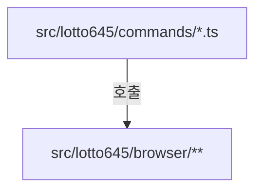
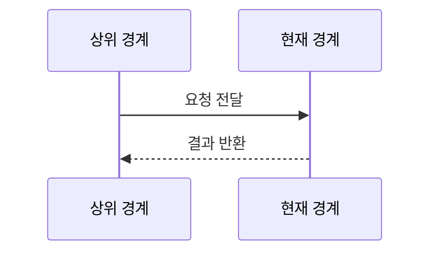
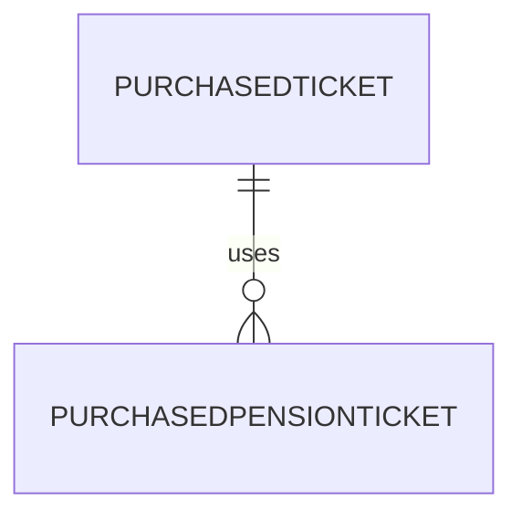

# weekly-lotto 구현 상세
Schema-Version: SRTE-DOCS-1

## 모듈 분해
- CLI 진입점: `src/lotto645/commands/*.ts`, `src/pension720/commands/*.ts`.
- 도메인별 브라우저 액션: `src/lotto645/browser/**`, `src/pension720/browser/**`.
- 공통 인프라: `src/shared/browser/**`, `src/shared/config/index.ts`, `src/shared/services/email.service.ts`, `src/shared/utils/*.ts`.
- 공통 진단 확장: `src/shared/ocr/**`(실패 스크린샷 OCR, HTML 스냅샷 정규화).
- 결과 처리: `src/lotto645/services/*.ts`, `src/pension720/services/*.ts`.
- 검증: `tests/*.spec.ts`, `tests/utils/*.ts`, `playwright.config.ts`.

## 호출 흐름
1. npm script가 도메인별 `commands/*.ts`의 `main()`을 실행한다.
2. 커맨드가 브라우저 세션 생성 후 공통 로그인 액션을 호출한다.
   - 로그인 액션은 `https://www.dhlottery.co.kr/` 선접속 후 `/login`으로 이동한다.
3. 도메인별 브라우저 액션으로 구매/조회/당첨번호 데이터를 수집한다.
4. 서비스 계층에서 결과 집계/출력을 수행하고 필요 시 이메일을 전송한다.
5. 실패 경로에서는 스크린샷/HTML(메인+프레임)/OCR 진단을 수집하고 첨부 메일을 구성한다.
6. 모든 커맨드는 `finally`에서 브라우저 세션을 종료한다.

## 핵심 알고리즘
- 구매 선검증/후검증:
  - 구매 전 최근 N분 구매 티켓을 조회한다.
  - 있으면 구매를 건너뛰고 기존 티켓 반환.
  - 없으면 구매 실행 후 다시 최근 N분 내 발행 티켓으로 검증.
- 당첨 확인:
  - 메인 슬라이더에서 최신 당첨번호 파싱.
  - 회차별 티켓 조회.
  - 도메인별 규칙으로 등수 집계 후 요약 생성.

## 데이터 모델
- 로또: `PurchasedTicket`, `WinningNumbers`, `WinningRank`.
- 연금: `PurchasedPensionTicket`, `PensionWinningNumbers`, `PensionWinningRank`.
- 공통: `Config`, `EmailConfig`, `EmailOptions`, `EmailResult`.
- 실패 진단: `OcrResult`, `HtmlSnapshotResult`, `FailureArtifacts`.

## 외부 연동 정책
- 브라우저 연동: Playwright `page.goto`와 locator 대기 사용.
  - 로그인 준비 네비게이션 순서: `홈페이지 -> 로그인 페이지`.
- 재시도: `withRetry`(지수 백오프+지터) 사용.
- timeout: 주요 이동 60초, 요소 대기 10~30초, OCR 처리 5초.
- backoff/circuit breaker/idempotency key: circuit breaker/idempotency key는 구현되지 않았다.

## 설정
- 계정: `LOTTO_USERNAME`, `LOTTO_PASSWORD`.
- 이메일: `LOTTO_EMAIL_SMTP_HOST`, `LOTTO_EMAIL_SMTP_PORT`, `LOTTO_EMAIL_USERNAME`, `LOTTO_EMAIL_PASSWORD`, `LOTTO_EMAIL_FROM`, `LOTTO_EMAIL_TO`.
- 실행 옵션: `DRY_RUN`, `HEADED`, `CI`, `PENSION_GROUP`.

## 예외 처리 전략
- 커맨드 계층: `try/catch`에서 오류 로그 후 `process.exit(1)`.
- 브라우저 액션: 실패 시 스크린샷 저장 후 예외 전파 또는 `null` 반환.
- 설정/메일: 검증 실패는 throw, 메일 전송 실패는 실패 결과로 반환.

## 실패 상세 진단 구현 정책
- 명령/액션 실패는 공통 구조(`error.code`, `error.category`, `error.message`, `error.retryable`)로 수렴시킨다.
- `withRetry` 기반 실패는 `retry.attemptCount`, `retry.maxRetries`, `retry.lastErrorMessage`를 함께 기록한다.
- `UNKNOWN_UNCLASSIFIED`는 규칙 미매칭 예외에만 사용하고 `classificationReason`을 필수 기록한다.
- 구매 실패 이메일/콘솔 실패 출력은 동일한 에러 코드와 카테고리를 노출한다.
- 실패 시 스크린샷과 HTML 스냅샷(메인+프레임)을 함께 수집하고 OCR 힌트를 `ocr.hintCode`로 정규화한다.
- 실패 이메일 첨부 총량은 10MB 상한을 적용하고, 초과 시 `attachment.status=PARTIAL`로 부분 첨부한다.

## 관측성
- 콘솔 로그로 단계별 진행/실패 원인을 출력.
- 스크린샷은 `screenshots/` 아래 저장.
- HTML 스냅샷은 `artifacts/html-failures/` 아래 저장한다.
- OCR 결과는 `ocr.status`, `ocr.text`, `ocr.confidence`, `ocr.hintCode`로 기록한다.
- E2E는 Playwright 리포트, trace, attachment(`*-diagnostics`)를 남긴다.

## 테스트 설계
- 단위 테스트: `src/**/*test.ts`(Vitest).
- E2E 테스트: `tests/*.spec.ts`(Playwright).
- 테스트 유틸: `tests/utils`에서 네트워크 가드/점검 감지/실패 진단 attachment 제공.

## 모듈 인벤토리 (권장)
| 모듈 | 경로 | 역할 |
|---|---|---|
| lotto645 | `src/lotto645/**` | 로또 구매/조회/당첨확인 도메인 통합 |
| pension720 | `src/pension720/**` | 연금복권 구매/조회/당첨확인 도메인 통합 |
| shared | `src/shared/**` | 공통 브라우저/설정/메일/유틸 제공 |
| tests | `tests/**` | E2E 검증 및 실패 진단 유틸 |

## 파일 계약 (핵심 파일 상세, 권장)
| 파일 | 외부 노출 심볼 | 입력 | 출력 | 오류/제약 |
|---|---|---|---|---|
| `src/lotto645/commands/buy.ts` | `main` | env + 브라우저 세션 | 구매 로그/선택적 이메일 | 실패 시 종료 코드 1 |
| `src/pension720/commands/buy.ts` | `main` | env + 브라우저 세션 | 구매 로그/선택적 이메일 | 실패 시 종료 코드 1 |
| `src/shared/config/index.ts` | `getConfig` | `process.env` | `Config` | 스키마 위반 시 throw |
| `src/shared/services/email.service.ts` | `sendEmail` | `EmailOptions` | `EmailResult` | SMTP 실패 시 `success=false` |
| `tests/utils/failure-diagnostics.ts` | `buildFailureReason`, `waitVisibleWithReason` | `Page`, `TestInfo`, probes | diagnostics attachment | locator 실패 시 예외 전파 |

## 시나리오 추적성 (권장)
| SCN | 구현 파일#심볼 | 테스트명 |
|---|---|---|
| SCN-001 | `src/shared/browser/actions/login.ts#login` | `tests/login.spec.ts::홈페이지 선접속 후 로그인 페이지가 로드된다` |
| SCN-002 | `src/shared/browser/actions/login.ts#login` | `tests/login.spec.ts::잘못된 비밀번호로 로그인에 실패한다` |
| SCN-003 | `src/lotto645/commands/buy.ts#main` | `tests/lotto645.spec.ts::should_capture_ocr_and_html_artifacts_on_failure` |

## 변경 규칙 (권장)
- MUST: `commands/*` 흐름을 변경하면 `tests/*.spec.ts` 해당 시나리오를 함께 갱신한다.
- MUST: `src/shared/config/index.ts` 또는 `src/shared/utils/retry.ts`를 변경하면 단위 테스트를 함께 갱신한다.
- MUST NOT: `DRY_RUN` 보호 경로를 제거하거나 실구매 경로를 기본값으로 바꾸지 않는다.
- 함께 수정할 테스트 목록: `tests/lotto645.spec.ts`, `tests/pension720.spec.ts`, `src/shared/config/index.test.ts`, `src/shared/utils/retry.test.ts`.

## 알려진 제약
- 자동화는 동행복권 웹 DOM 구조 변경에 민감하다.
- 운영 스케줄에서 `DRY_RUN=false` 설정 시 실제 결제가 발생할 수 있다.

## 오픈 질문
- 내용: `package.json`의 `claude`, `update`, `upgrade` 의존성이 런타임/개발 흐름에서 실제로 사용되는지 확인이 필요하다.
- 확인 불가 사유: 저장소 코드 경로에서 해당 패키지를 직접 import/실행하는 근거를 확인하지 못했다.
- 확인 경로: `package.json` scripts, CI workflow, 실제 배포/운영 실행 로그에서 패키지 호출 여부를 점검한다.
- 해소 조건: 세 패키지의 사용 경로가 코드/워크플로우에서 확인되거나 제거 커밋으로 정리되면 항목을 닫는다.
