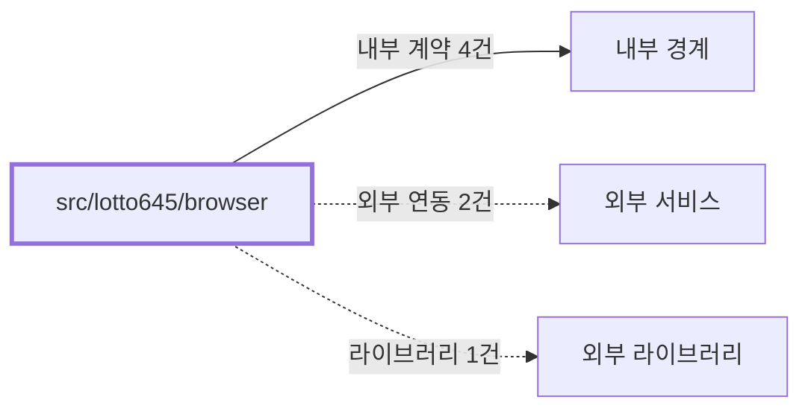

# lotto645/browser
Schema-Version: SRTE-DOCS-1

## 목적
이 경계는 로또 6/45 UI 자동화용 브라우저 계약을 제공한다.
모바일 구매 페이지 셀렉터와 액션 조합의 공개 기준을 정의한다.

## 기능 범위/비범위
- 포함: 로또 모바일 구매 URL/버튼/팝업 셀렉터 상수 제공.
- 포함: 구매 실행, 구매내역 파싱, 당첨번호 수집 액션 제공.
- 비포함: CLI 실행 오케스트레이션, 이메일 전송, 환경 변수 검증.

## 공개 인터페이스 계약
- 입력 타입/필드:
  - `Page`.
  - 구매 모드(`dryRun`), 조회 조건(`maxMinutes`, `targetRound`, `maxCount`).
- 필수/옵션:
  - `Page`는 필수.
  - 조회/검증 조건 파라미터는 옵션(함수 기본값 사용 가능).
- 유효성 규칙:
  - 당첨번호 파싱 시 1~45 범위 숫자 7개(보너스 포함) 미충족이면 실패로 처리한다.
  - 구매내역 파싱 시 번호 6개 미만이면 티켓을 무효 처리한다.
- 출력 타입/필드:
  - `purchaseSelectors` 상수.
  - `PurchasedTicket` 단건/목록.
  - `WinningNumbers | null`.

## 행동 시나리오
- SCN-001: Given 로그인된 세션, When 로또 구매/조회/당첨번호 조회 함수를 호출, Then `ticketsCount>=0` and `winningNumbersParsed=true`.
- SCN-002: Given 외부 DOM 또는 네트워크 오류, When 액션 실행 중 예외 발생, Then `errorExposed=true` and (`returnValue=null` or `exceptionRaised=true`).

## 오류 계약
- 에러 코드: 없음(명시적 에러 코드 상수 없음).
- HTTP status(해당 시): 없음(브라우저 자동화 컨텍스트).
- 재시도 가능 여부: 가능(`withRetry` 적용 경로).
- 발생 조건: 구매 페이지 진입 실패, 팝업/셀렉터 대기 타임아웃, 파싱 실패.

## 불변식/제약
- 트랜잭션 경계: 없음.
- 정합성 규칙: 구매 검증은 구매내역 페이지(LO40 필터) 기반 티켓 파싱 결과를 사용한다.
- 멱등성 규칙: `dryRun=true`인 구매 호출은 실제 결제를 발생시키지 않는다.
- 순서 보장 규칙: 구매 액션은 페이지 이동 -> 번호 선택 -> 구매 버튼 -> 팝업 처리 순서를 따른다.

## 비기능 요구
- 성능(SLO): 코드에 별도 수치형 SLO 상수는 없다.
- 보안 요구: 로그인 자격 증명은 `Page` 상호작용으로만 사용하며 문서/코드에 하드코딩하지 않는다.
- 타임아웃: 주요 이동 60초, 요소 대기 30초 내외.
- 동시성 요구: 단일 `Page` 호출 단위로 순차 실행을 가정한다.

## 의존성 계약
- 내부 경계: `src/lotto645/browser/actions`, `src/shared/browser/actions`, `src/shared/browser`, `src/shared/utils`.
- 외부 서비스: `https://ol.dhlottery.co.kr`, `https://www.dhlottery.co.kr`.
- 외부 라이브러리: Playwright.

## 수용 기준
- [ ] 로또 모바일 구매 셀렉터 상수가 코드와 일치한다.
- [ ] 구매/조회/당첨번호 액션이 `Page` 입력으로 호출 가능하다.
- [ ] 실패 경로에서 스크린샷 저장 또는 명시적 실패 반환이 수행된다.
