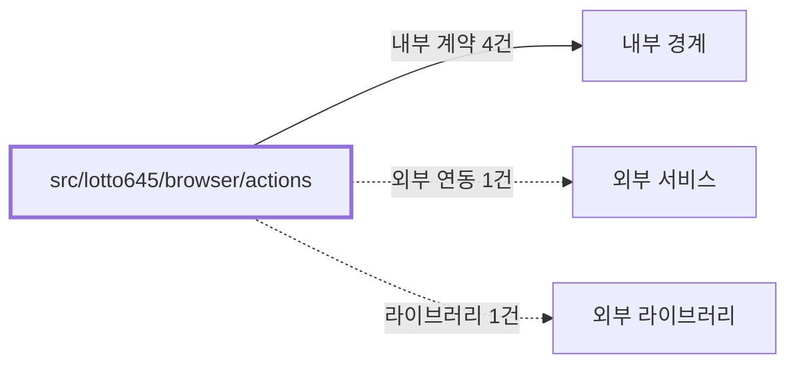

# lotto645/browser/actions
Schema-Version: SRTE-DOCS-1

## 목적
이 경계는 로또 6/45 브라우저 액션 구현의 함수 계약을 제공한다.
구매 실행, 구매내역 파싱, 당첨번호 파싱을 재사용 가능한 단위로 보장한다.

## 기능 범위/비범위
- 포함: `purchaseLotto`, `checkRecentPurchase`, `verifyRecentPurchase`, `getTicketsByRound`, `getAllTicketsInWeek`, `fetchLatestWinningNumbers`.
- 포함: 구매내역 모달(`Lotto645TicketP`) 파싱.
- 비포함: 로그인 실행, 브라우저 세션 생성/종료, 이메일 발송.

## 공개 인터페이스 계약
- 입력 타입/필드:
  - `Page`.
  - `dryRun`, `maxMinutes`, `targetRound`, `maxCount`.
- 필수/옵션:
  - `Page`는 필수.
  - `dryRun`/조회 파라미터는 옵션이며 기본값 사용 가능.
- 유효성 규칙:
  - 티켓 번호는 1~45 범위 6개만 유효.
  - 당첨번호는 6개 + 보너스 1개를 만족해야 유효.
- 출력 타입/필드:
  - `Promise<PurchasedTicket[]>`, `Promise<PurchasedTicket | null>`, `Promise<WinningNumbers | null>`, `void`.

## 행동 시나리오
- SCN-001: Given 로그인된 세션, When `purchaseLotto`를 호출, Then `preCheckDone=true` and `verificationResult!=undefined`.
- SCN-002: Given 파싱 대상 모달/슬라이더가 비정상, When 조회 함수를 호출, Then `error.code=DOM_SELECTOR_NOT_VISIBLE` or `error.code=PARSE_FORMAT_INVALID` and (`returnValue=null` or `exceptionRaised=true`).

## 오류 계약
- 에러 코드: `NETWORK_NAVIGATION_TIMEOUT`, `DOM_SELECTOR_NOT_VISIBLE`, `PARSE_FORMAT_INVALID`, `PURCHASE_VERIFICATION_FAILED`, `UNKNOWN_UNCLASSIFIED`.
- HTTP status(해당 시): 없음(브라우저 자동화 컨텍스트).
- 재시도 가능 여부: 가능(`withRetry` 적용).
- 발생 조건: 페이지 이동 실패, 요소 대기 타임아웃, 파싱 결과 유효성 미충족.

## 불변식/제약
- 트랜잭션 경계: 없음.
- 정합성 규칙: 회차별 조회는 동일 회차 티켓만 결과에 포함한다.
- 멱등성 규칙: `dryRun=true`이면 구매 확인 팝업 취소 후 종료한다.
- 순서 보장 규칙: 구매내역 검증은 구매 실행 이후 수행한다.

## 비기능 요구
- 성능(SLO): 코드에 별도 수치형 SLO 상수는 없다.
- 보안 요구: 민감 정보는 이 경계에서 직접 저장/출력하지 않는다.
- 타임아웃: 네비게이션 60초, 로케이터 대기 30초 내외.
- 동시성 요구: 단일 `Page` 기준 순차 실행 경로를 따른다.

## 의존성 계약
- 내부 경계: `src/lotto645/domain`, `src/shared/browser/actions`, `src/shared/browser`, `src/shared/utils`.
- 외부 서비스: 동행복권 모바일 구매/구매내역/메인 페이지.
- 외부 라이브러리: Playwright.

## 수용 기준
- [ ] 실구매 경로가 선검증 -> 구매 -> 후검증 순서를 따른다.
- [ ] 구매내역/당첨번호 파싱 함수가 타입 계약대로 값을 반환한다.
- [ ] 오류 경로에서 재시도 및 실패 노출 동작이 코드와 일치한다.
- [ ] 파싱/검증 실패가 구조화된 분류 코드로 표현된다.
