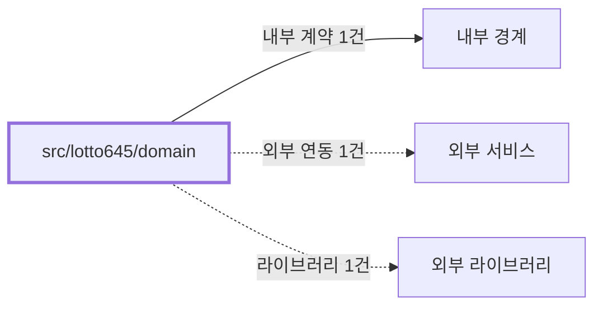

# lotto645/domain
Schema-Version: SRTE-DOCS-1

## 목적
이 경계는 로또 6/45 도메인 타입과 당첨 판정 계약을 정의한다.
상위 경계가 동일한 타입/등수 규칙으로 데이터를 교환하도록 보장한다.

## 기능 범위/비범위
- 포함: `PurchasedTicket`, `WinningNumbers`, `WinningRank` 타입/인터페이스 제공.
- 포함: 등수 라벨/당첨 여부 판단 함수 및 번호 일치 계산 함수 제공.
- 비포함: 브라우저 파싱, 구매내역 조회, 이메일 템플릿 렌더링.

## 공개 인터페이스 계약
- 입력 타입/필드:
  - 구매 번호 배열(`number[]`).
  - 당첨 정보(`WinningNumbers`: `numbers[6]`, `bonusNumber`).
- 필수/옵션:
  - `checkWinning` 호출 시 번호 배열과 당첨 정보는 필수.
  - `PurchasedTicket.saleDate/drawDate/winResult`는 옵션.
- 유효성 규칙:
  - 등수 판정은 일치 개수(6/5+보너스/5/4/3/기타) 규칙을 따른다.
  - 일치 개수 계산 시 구매 번호 중복은 집합으로 제거한다.
- 출력 타입/필드:
  - `WinningRank` (`rank1`~`rank5` 또는 `none`).
  - `getMatchingNumbers` 결과 배열.

## 행동 시나리오
- SCN-001: Given 유효한 구매 번호와 당첨번호, When `checkWinning`을 호출, Then `resultType=WinningRank` and `result in {rank1,rank2,rank3,rank4,rank5,none}`.
- SCN-002: Given 번호 중복 또는 비표준 입력, When 일치 번호 계산 함수를 호출, Then `duplicateRemoved=true` and `matchCount<=6`.

## 오류 계약
- 에러 코드: 없음(순수 함수 기반, 명시적 throw 없음).
- HTTP status(해당 시): 없음.
- 재시도 가능 여부: 해당 없음.
- 발생 조건: 명시적 throw 경로가 없어 오류 발생 계약을 별도로 정의하지 않는다.

## 불변식/제약
- 트랜잭션 경계: 없음.
- 정합성 규칙: `WinningRank` 라벨 매핑은 고정 값이다.
- 멱등성 규칙: 동일 입력에 대해 동일 결과를 반환한다.
- 순서 보장 규칙: 등수 판정은 1등부터 5등, 이후 낙첨 순으로 평가한다.

## 비기능 요구
- 성능(SLO): 동기 계산 유틸 경계로 별도 수치형 SLO를 정의하지 않는다.
- 보안 요구: 민감 정보 처리 없음.
- 타임아웃: 해당 없음(동기 계산).
- 동시성 요구: 순수 함수로 공유 상태가 없다.

## 의존성 계약
- 내부 경계: `src/shared/utils/date` re-export.
- 외부 서비스: 없음.
- 외부 라이브러리: 없음.

## 수용 기준
- [ ] 로또 도메인 타입이 상위 경계에서 import 가능하다.
- [ ] `checkWinning` 결과가 코드에 정의된 등수 규칙과 일치한다.
- [ ] 라벨/일치번호 유틸이 도메인 계약대로 동작한다.

## 오픈 질문
- 없음
