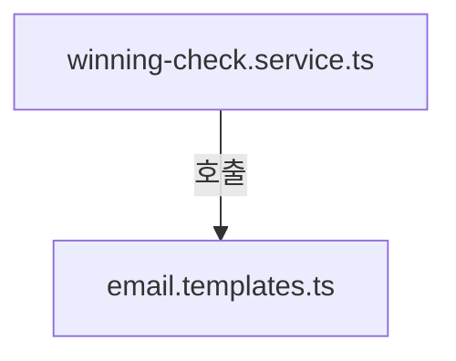
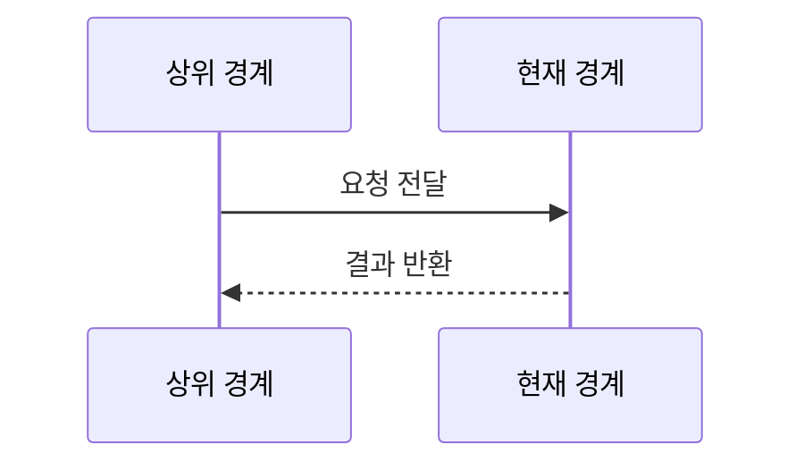
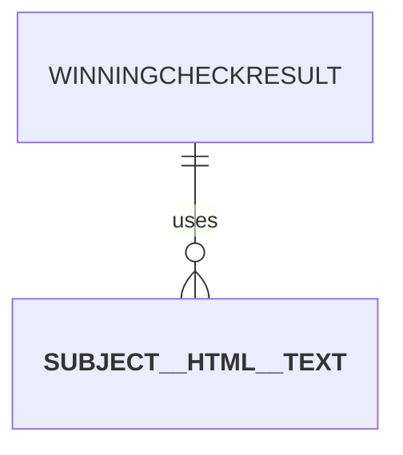

# lotto645/services 구현 상세
Schema-Version: SRTE-DOCS-1

## 모듈 분해
- `winning-check.service.ts`: 티켓별 등수 계산 결과를 집계하고 콘솔 출력 형태로 변환.
- `email.templates.ts`: 구매 성공/실패/당첨 결과용 subject/html/text 생성.

## 호출 흐름
1. 상위 커맨드가 당첨번호/티켓 목록을 전달한다.
2. `checkTicketsWinning`이 도메인 판정 함수를 이용해 결과 목록과 요약을 생성한다.
3. 필요 시 템플릿 함수가 집계 결과를 이메일 콘텐츠로 변환한다.

## 핵심 알고리즘
- 집계 알고리즘:
  - 각 티켓의 등수/일치번호/보너스 일치 여부 계산.
  - 당첨 티켓 수와 등수별 카운트를 집계해 summary 문자열 생성.
- 템플릿 렌더링:
  - 번호 값에 따라 배경색을 계산해 인라인 스타일 HTML 생성.
  - 오류 문자열은 `escapeHtml`로 치환한다.

## 데이터 모델
- `WinningCheckResult`, `TicketWinningResult`.
- 이메일 템플릿 반환형 `{ subject, html, text }`.

## 외부 연동 정책
- 외부 서비스 직접 호출 없음.
- timeout/retry/backoff/circuit breaker/idempotency key: 해당 없음.

## 설정
- 환경 변수 직접 사용 없음.
- 템플릿 결과는 상위 경계가 전송 여부를 판단한다.

## 예외 처리 전략
- 집계 함수는 명시적 throw 없이 결과 객체를 반환한다.
- 템플릿 함수는 입력 문자열 기반으로 결과를 생성하며 명시적 예외 throw 경로는 없다.

## 관측성
- 콘솔 출력 함수에서 결과 요약/티켓별 상세를 출력한다.
- 별도 메트릭/트레이싱 구현은 없다.

## 테스트 설계
- 도메인 판정은 `src/lotto645/domain/winning.test.ts`로 간접 검증된다.
- 서비스 단위 테스트: `src/lotto645/services/winning-check.service.test.ts`.

## 시나리오 추적성 (권장)
| SCN | 구현 파일#심볼 | 테스트명 |
|---|---|---|
| SCN-001 | `src/lotto645/services/winning-check.service.ts#checkTicketsWinning` | `src/lotto645/services/winning-check.service.test.ts::returns summary with winnerCount less than or equal to totalCount` |
| SCN-002 | `src/lotto645/services/email.templates.ts#purchaseFailureTemplate` | `src/lotto645/services/winning-check.service.test.ts::builds failure template with failure subject and escaped error message` |

## 파일 계약 (핵심 파일 상세, 권장)
| 파일 | 외부 노출 심볼 | 입력 | 출력 | 오류/제약 |
|---|---|---|---|---|
| `winning-check.service.ts` | `checkTicketsWinning`, `printWinningResult` | `PurchasedTicket[]`, `WinningNumbers` | `WinningCheckResult`, 콘솔 출력 | `winnerCount<=totalCount` 보장 |
| `email.templates.ts` | `purchaseSuccessTemplate`, `purchaseFailureTemplate`, `winningResultTemplate` | 집계 결과/오류 문자열 | `{ subject, html, text }` | 오류 문자열 HTML 이스케이프 |

## 변경 규칙 (권장)
- MUST: 집계 결과의 `round`는 입력 회차와 동일해야 한다.
- MUST: 템플릿에서 사용자 입력 문자열은 이스케이프 처리한다.
- MUST NOT: 서비스 계층에서 SMTP 전송을 직접 수행하지 않는다.
- 함께 수정할 테스트 목록: `src/lotto645/services/winning-check.service.test.ts`.

## 알려진 제약
- 이메일 HTML은 메일 클라이언트 렌더링 차이에 영향을 받을 수 있다.

## 오픈 질문
- 없음
