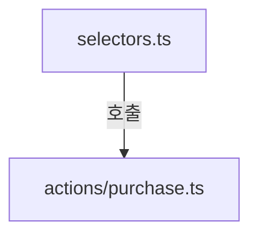
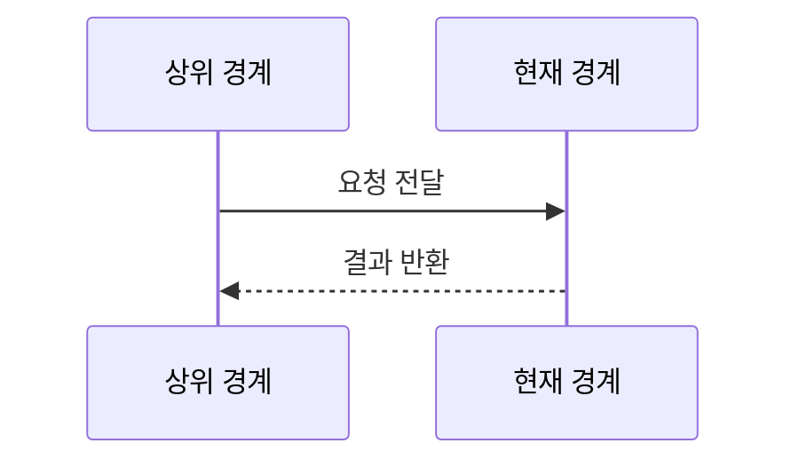
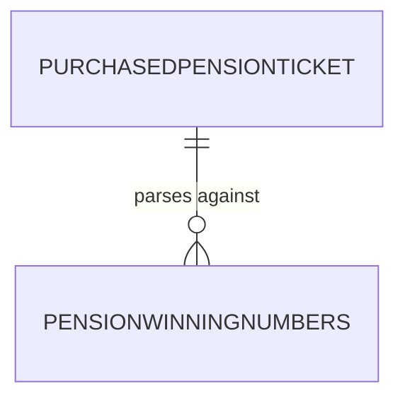

# pension720/browser 구현 상세
Schema-Version: SRTE-DOCS-1

## 모듈 분해
- `selectors.ts`: 구매 URL, 텍스트 셀렉터, 요일별 조 매핑.
- `actions/purchase.ts`: 구매 실행/DRY RUN 및 검증 연결.
- `actions/check-purchase.ts`: 구매내역 모달 파싱과 조회 함수.
- `actions/fetch-winning.ts`: 메인 슬라이더 당첨번호 파싱.

## 호출 흐름
1. 상위 커맨드가 browser/actions 함수를 호출한다.
2. 구매 흐름은 조 선택 규칙 계산 후 구매 액션으로 분기한다.
3. 조회/검증 흐름은 구매내역 이동 후 모달 파싱을 수행한다.
4. 당첨조회 흐름은 메인 슬라이더 파싱으로 종료한다.

## 핵심 알고리즘
- 조 선택 알고리즘: 월~금은 1~5조 매핑, 주말은 1조 기본값.
- 구매 검증 알고리즘:
  - 구매 전 최근 구매 확인.
  - 구매 후 최근 N분 내 티켓 존재 여부 검증.
- 당첨번호 알고리즘:
  - active 슬라이드 우선, 없으면 마지막 슬라이드 fallback.

## 데이터 모델
- 출력 모델: `PurchasedPensionTicket`, `PensionWinningNumbers`.
- 입력/중간 데이터: 조 번호, 6자리 번호 배열, 회차/발행일 텍스트.

## 외부 연동 정책
- 대상 URL: `https://el.dhlottery.co.kr/.../pension720/game.jsp`, `https://www.dhlottery.co.kr/main`.
- retry/backoff: `withRetry` 사용.
- timeout: 이동 60초, 요소 대기 10~30초.
- circuit breaker/idempotency key: 구현 없음.

## 설정
- 직접 읽는 환경 변수는 없음(상위에서 전달된 `group`, `dryRun` 사용).

## 예외 처리 전략
- 구매 실패 시 스크린샷 저장 후 예외 재던짐.
- 파싱 실패는 `null` 반환 경로로 상위에서 건너뛴다.

## 관측성
- 단계별 진행 로그 및 경고 로그를 출력한다.
- 오류 스크린샷을 `screenshots/`에 저장한다.

## 테스트 설계
- 간접 검증: `tests/pension720.spec.ts`에서 구매/구매내역/당첨번호 UI를 검증.
- 직접 단위 테스트 파일은 없다.

## 모듈 인벤토리 (권장)
| 모듈 | 파일 | 역할 |
|---|---|---|
| selectors | `selectors.ts` | 구매 셀렉터/조 매핑 상수 |
| purchase actions | `actions/purchase.ts` | 구매 실행/검증 |
| check actions | `actions/check-purchase.ts` | 구매내역 조회/모달 파싱 |
| winning actions | `actions/fetch-winning.ts` | 당첨번호 슬라이더 파싱 |

## 파일 계약 (핵심 파일 상세, 권장)
| 파일 | 외부 노출 심볼 | 입력 | 출력 | 오류/제약 |
|---|---|---|---|---|
| `selectors.ts` | `purchaseSelectors`, `getGroupByDayOfWeek` | 없음 | 셀렉터/조 계산 상수 | DOM 변경 시 갱신 필요 |
| `actions/purchase.ts` | `purchasePension` | `Page`, `dryRun`, `group?` | `PurchasedPensionTicket[]` | 실패 시 예외 전파 |
| `actions/check-purchase.ts` | `getTicketsByRound` 등 | `Page`, 회차/개수 | 티켓 배열 | 파싱 실패 시 빈 결과/예외 |
| `actions/fetch-winning.ts` | `fetchLatestPensionWinning` | `Page` | `PensionWinningNumbers|null` | 파싱 실패 시 `null` |

## 시나리오 추적성 (권장)
| SCN | 구현 파일#심볼 | 테스트명 |
|---|---|---|
| SCN-001 | `src/pension720/browser/actions/purchase.ts#purchasePension` | `tests/pension720.spec.ts::구매 페이지(game_mobile)에 접근할 수 있다` |
| SCN-002 | `src/pension720/browser/actions/fetch-winning.ts#fetchLatestPensionWinning` | `tests/pension720.spec.ts::티켓 모달에서 6자리 번호를 추출할 수 있다` |

## 변경 규칙 (권장)
- MUST: 셀렉터/파싱 로직 변경 시 `tests/pension720.spec.ts`를 함께 갱신한다.
- MUST: 구매 검증 흐름 변경 시 `actions/purchase.ts`와 `actions/check-purchase.ts`를 함께 점검한다.
- MUST NOT: `dryRun=true` 경로에서 실구매 클릭을 수행하지 않는다.
- 함께 수정할 테스트 목록: `tests/pension720.spec.ts`.

## 알려진 제약
- 외부 사이트 DOM/텍스트 변경에 매우 민감하다.
