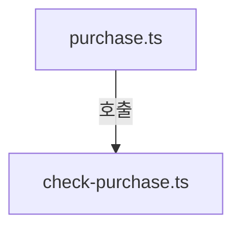
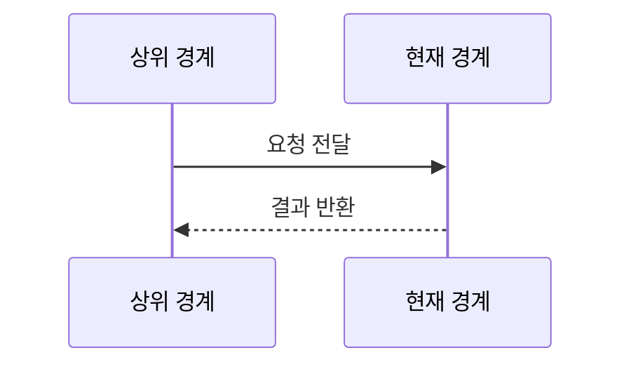
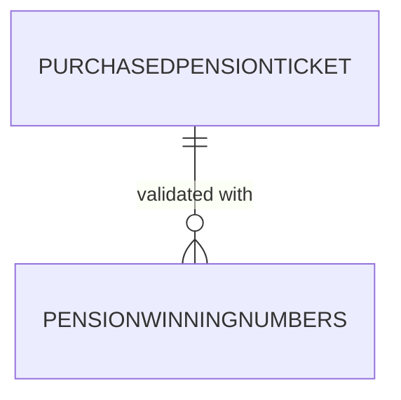

# pension720/browser/actions 구현 상세
Schema-Version: SRTE-DOCS-1

## 모듈 분해
- `purchase.ts`: 조 결정, 실구매/DRY RUN 분기, 선검증/후검증 흐름.
- `check-purchase.ts`: 구매내역 이동, 모달 파싱, 회차/주간 조회, 요약 출력.
- `fetch-winning.ts`: 연금 슬라이더 파싱과 당첨번호 객체 생성.

## 호출 흐름
1. `purchasePension`이 조를 결정하고 DRY RUN 여부를 분기한다.
2. 실구매 경로는 최근 구매 확인 후 구매 실행/검증을 수행한다.
3. 조회 함수는 구매내역 페이지에서 바코드별 모달 파싱을 반복한다.
4. 당첨조회 함수는 메인 페이지 슬라이더에서 1등/보너스 번호를 추출한다.

## 핵심 알고리즘
- 티켓 파싱:
  - `.ticket-cate`에서 조 번호 추출.
  - `.ticket-num-in` 6자리 추출 후 `formatPensionNumber` 적용.
  - 모드/회차/발행일/추첨일 텍스트를 조합해 티켓 생성.
- 당첨번호 파싱:
  - `.wf720-list` 1번째에서 1등 조/번호 6자리 추출.
  - 2번째에서 보너스 번호 6자리 추출.

## 데이터 모델
- `PurchasedPensionTicket`, `PensionWinningNumbers`.
- 내부 유효성: 조 번호 1~5, 번호 6자리.

## 외부 연동 정책
- 구매내역 이동은 shared `navigateToPurchaseHistory(LP72)` 사용.
- retry/backoff: `withRetry` 사용.
- timeout: 이동 60초, 모달/요소 대기 5~30초.
- circuit breaker/idempotency key: 명시적 구현 없음.

## 설정
- `purchasePension(page, dryRun = true, group?)` 인자 사용.
- `maxMinutes`, `maxCount`는 함수 파라미터/기본값으로 제어.

## 예외 처리 전략
- 구매 예외 발생 시 스크린샷 저장 후 예외를 재던진다.
- 티켓/당첨번호 파싱 실패는 `null` 반환으로 처리한다.

## 실패 상세 진단 구현 정책
- 구매 페이지 이동/요소 대기 실패는 `NETWORK_NAVIGATION_TIMEOUT` 또는 `DOM_SELECTOR_NOT_VISIBLE`로 분류한다.
- 모달/슬라이더 파싱 실패는 `PARSE_FORMAT_INVALID`로 분류하고 원본 selector 상태를 진단 요약에 포함한다.
- 후검증 미탐지는 `PURCHASE_VERIFICATION_FAILED`로 고정 분류한다.

## 관측성
- 단계별 `console.log` 및 파싱 실패 `console.warn`/`console.error` 로그 출력.
- 스크린샷 prefix에 액션 컨텍스트를 반영한다.

## 테스트 설계
- E2E: `tests/pension720.spec.ts`가 구매/내역/슬라이더 파싱 경로를 간접 검증.
- 직접 단위 테스트는 없다.

## 모듈 인벤토리 (권장)
| 모듈 | 파일 | 역할 |
|---|---|---|
| purchase action | `purchase.ts` | 조 선택/실구매/검증 흐름 |
| check-purchase action | `check-purchase.ts` | 구매내역 조회/모달 파싱 |
| fetch-winning action | `fetch-winning.ts` | 연금 당첨번호 슬라이더 파싱 |

## 파일 계약 (핵심 파일 상세, 권장)
| 파일 | 외부 노출 심볼 | 입력 | 출력 | 오류/제약 |
|---|---|---|---|---|
| `purchase.ts` | `purchasePension` | `Page`, `dryRun`, `group?` | `PurchasedPensionTicket[]` | 실패 시 예외 전파 |
| `check-purchase.ts` | `getTicketsByRound`, `getAllTicketsInWeek` | `Page`, 조회 조건 | 티켓 배열 | 파싱 실패 시 `null`/건너뜀 |
| `fetch-winning.ts` | `fetchLatestPensionWinning` | `Page` | `PensionWinningNumbers|null` | 파싱 실패 시 `null` |

## 시나리오 추적성 (권장)
| SCN | 구현 파일#심볼 | 테스트명 |
|---|---|---|
| SCN-001 | `src/pension720/browser/actions/purchase.ts#purchasePension` | `tests/pension720.spec.ts::DRY RUN: 번호 선택 → 조 선택 → 자동번호 → 선택완료까지 진행` |
| SCN-002 | `src/pension720/browser/actions/check-purchase.ts#getTicketDetails` | `tests/pension720.spec.ts::티켓 모달에서 6자리 번호를 추출할 수 있다` |

## 변경 규칙 (권장)
- MUST: 구매 액션 분기 변경 시 `purchase.ts`의 선검증/후검증 순서를 유지한다.
- MUST: 모달/슬라이더 파싱 규칙 변경 시 `check-purchase.ts`와 `fetch-winning.ts`를 함께 검토한다.
- MUST NOT: 실패 경로의 `null` 반환/예외 전파 계약을 제거하지 않는다.
- 함께 수정할 테스트 목록: `tests/pension720.spec.ts`.

## 알려진 제약
- 모달/슬라이더 CSS 클래스와 텍스트 규칙 변경 시 파싱이 깨질 수 있다.
