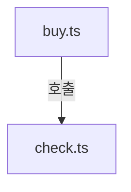
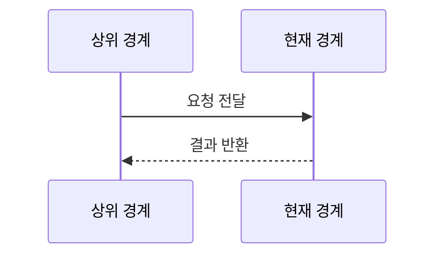
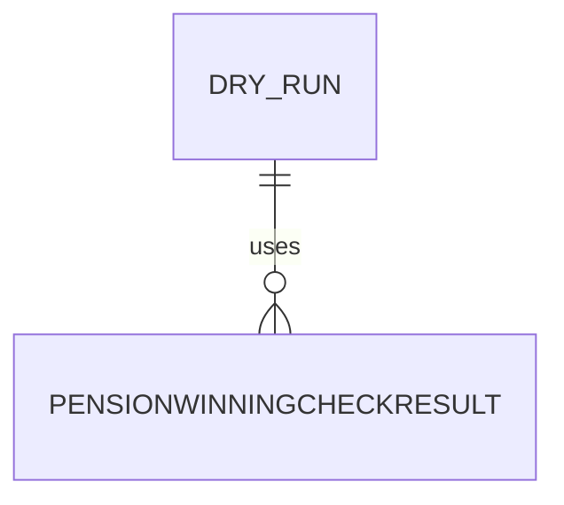

# pension720/commands 구현 상세
Schema-Version: SRTE-DOCS-1

## 모듈 분해
- `buy.ts`: 구매 실행, `PENSION_GROUP` 파싱, 메일 전송.
- `check.ts`: 주간 구매내역 조회 및 요약 출력.
- `check-result.ts`: 당첨번호 조회/회차 조회/집계/메일 전송.

## 호출 흐름
1. 커맨드가 브라우저 세션을 생성한다.
2. 공통 로그인 함수를 호출한다.
3. 명령 목적별 도메인 브라우저 액션/서비스를 호출한다.
4. 실패 시 스크린샷/HTML/OCR 진단을 수집하고 첨부 메일을 구성한다.
5. 로그 후 `process.exit(1)` 처리한다.
6. `finally`에서 세션을 종료한다.

## 핵심 알고리즘
- `buy.ts`:
  - `DRY_RUN` 문자열 해석.
  - `PENSION_GROUP`이 1~5일 때만 적용, 아니면 경고 후 무시.
  - 구매 성공/실패 결과에 따라 템플릿 선택.
- `check-result.ts`:
  - 최신 당첨번호가 없거나 당일 추첨이 아니면 조기 종료.
  - 회차 티켓 집계 후 출력/메일 전송.

## 데이터 모델
- 입력: `DRY_RUN`, `PENSION_GROUP`, 로그인/이메일 관련 환경 변수.
- 출력: 콘솔 로그, `PensionWinningCheckResult`, 이메일 템플릿 데이터.

## 외부 연동 정책
- 브라우저 자동화와 메일 전송은 하위 경계에 위임한다.
- retry/backoff 정책은 하위 액션 구현(`withRetry`)을 따른다.
- circuit breaker/idempotency key: 명시적 구현 없음.

## 설정
- `PENSION_GROUP`은 1~5 유효값일 때만 적용.
- 이메일 전송은 `hasEmailConfig()`가 true일 때만 수행.

## 예외 처리 전략
- 최상위 `try/catch`에서 오류 로그를 남기고 종료 코드 1로 종료.
- 구매 실패 시 실패 템플릿 메일 전송을 추가 시도.

## 실패 상세 진단 구현 정책
- 최상위 catch는 기존 `process.exit(1)` 계약을 유지하면서 구조화 에러(`error.code`, `error.category`)를 로그에 포함한다.
- 실패 알림 메일 생성 시 단순 메시지 외 코드/카테고리/요약 진단을 함께 전달한다.
- 분류 미확정 실패는 `UNKNOWN_UNCLASSIFIED`와 `classificationReason`을 함께 출력한다.
- 실패 후처리에서 OCR 힌트(`ocr.hintCode`)와 HTML 스냅샷(메인/프레임)을 수집해 메일 첨부에 전달한다.
- 첨부 총량이 10MB를 넘으면 부분 첨부 상태를 출력/기록한다.

## 관측성
- 단계별 진행 로그와 실패 로그를 콘솔에 출력.
- DRY RUN 경로는 안내 로그와 스크린샷 경로를 출력.
- 실패 로그에는 `ocr.status`, `ocr.hintCode`, `html.main.path` 또는 `html.failureReason`을 포함한다.

## 테스트 설계
- E2E 간접 검증: `tests/pension720.spec.ts`.
- 커맨드 파일 직접 단위 테스트는 없다.

## 모듈 인벤토리 (권장)
| 모듈 | 파일 | 역할 |
|---|---|---|
| buy command | `buy.ts` | 구매 실행/결과 알림 |
| check command | `check.ts` | 주간 구매내역 조회 |
| check-result command | `check-result.ts` | 당첨 확인/집계/알림 |

## 파일 계약 (핵심 파일 상세, 권장)
| 파일 | 외부 노출 심볼 | 입력 | 출력 | 오류/제약 |
|---|---|---|---|---|
| `buy.ts` | `main` | env + 브라우저 세션 | 구매 결과 로그/메일 | 실패 시 `process.exit(1)` |
| `check.ts` | `main` | env + 브라우저 세션 | 구매내역 요약 로그 | 실패 시 `process.exit(1)` |
| `check-result.ts` | `main` | env + 브라우저 세션 | 당첨 집계 로그/메일 | 비추첨일 조기 종료 |

## 시나리오 추적성 (권장)
| SCN | 구현 파일#심볼 | 테스트명 |
|---|---|---|
| SCN-001 | `src/pension720/commands/buy.ts#main` | `tests/pension720.spec.ts::DRY RUN: 번호 선택 → 조 선택 → 자동번호 → 선택완료까지 진행` |
| SCN-002 | `src/pension720/commands/buy.ts#main` | `tests/login.spec.ts::잘못된 비밀번호로 로그인에 실패한다` |
| SCN-003 | `src/pension720/commands/buy.ts#main` | `tests/pension720.spec.ts::should_emit_ocr_and_html_artifacts_on_failure` |

## 변경 규칙 (권장)
- MUST: 종료 코드(`process.exit(1)`) 또는 조기 종료 조건 변경 시 시나리오 매핑 테스트를 갱신한다.
- MUST: `PENSION_GROUP`/`DRY_RUN` 분기 변경 시 보호 경로(유효값 검증, 실구매 가드)를 유지한다.
- MUST NOT: 최상위 `try/catch/finally` 세션 종료 경로를 제거하지 않는다.
- 함께 수정할 테스트 목록: `tests/pension720.spec.ts`, `tests/login.spec.ts`.

## 알려진 제약
- 추첨일이 아니면 당첨확인 명령은 결과 없이 종료된다.

## 오픈 질문
- 없음
