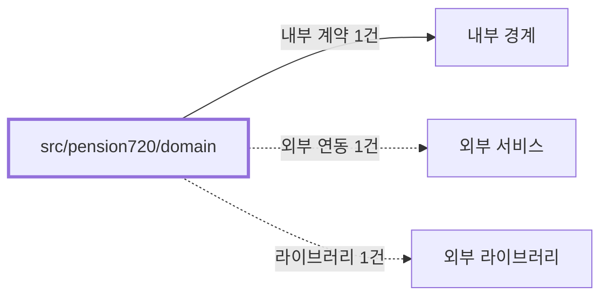

# pension720/domain
Schema-Version: SRTE-DOCS-1

## 목적
이 경계는 연금복권 720+ 도메인 타입 및 당첨 판정 계약을 정의한다.
조(1~5)와 6자리 번호 규칙을 기반으로 등수 판정을 일관되게 제공한다.

## 기능 범위/비범위
- 포함: `PensionGroup`, `PensionNumber`, `PurchasedPensionTicket`, `PensionWinningNumbers`, `PensionWinningRank` 정의.
- 포함: 조/번호 유효성 검사, 번호 포맷팅, 등수 판정 함수 제공.
- 비포함: 브라우저 파싱, CLI 실행, 이메일 템플릿 생성.

## 공개 인터페이스 계약
- 입력 타입/필드:
  - 구매 번호(`group`, `number`).
  - 당첨 정보(`winningGroup`, `winningNumber`, `bonusNumber`).
- 필수/옵션:
  - `checkPensionWinning` 입력은 모두 필수.
  - `PurchasedPensionTicket.saleDate/drawDate`는 옵션.
- 유효성 규칙:
  - 조는 1~5만 유효하다.
  - 번호는 6자리 문자열이어야 한다.
  - 등수 판정은 1등/2등/보너스/3~7등/낙첨 순서 규칙을 따른다.
- 출력 타입/필드:
  - `PensionWinningRank`.
  - 라벨 문자열(`getRankLabel`, `getModeLabel`, `getGroupLabel`).

## 행동 시나리오
- SCN-001: Given 유효한 구매번호와 당첨번호, When `checkPensionWinning` 호출, Then `resultType=PensionWinningRank` and `result!=undefined`.
- SCN-002: Given 비유효 조 또는 번호 형식, When 유효성 검사 함수를 호출, Then `isValidGroup=false` or `formattedNumber.length=6`.

## 오류 계약
- 에러 코드: 없음(명시적 throw 없음).
- HTTP status(해당 시): 없음.
- 재시도 가능 여부: 해당 없음.
- 발생 조건: 명시적 throw 경로가 없어 오류 발생 계약을 별도로 정의하지 않는다.

## 불변식/제약
- 트랜잭션 경계: 없음.
- 정합성 규칙: 번호 표현은 문자열 6자리 규칙을 유지한다.
- 멱등성 규칙: 동일 입력에 대해 동일 판정 결과를 반환한다.
- 순서 보장 규칙: 등수 판정은 상위 등수 우선 순서로 평가한다.

## 비기능 요구
- 성능(SLO): 동기 계산 유틸 경계로 별도 수치형 SLO를 정의하지 않는다.
- 보안 요구: 민감 정보 처리 없음.
- 타임아웃: 해당 없음.
- 동시성 요구: 공유 상태 없음.

## 의존성 계약
- 내부 경계: 없음.
- 외부 서비스: 없음.
- 외부 라이브러리: 없음.

## 수용 기준
- [ ] 연금복권 도메인 타입이 상위 경계에서 import 가능하다.
- [ ] `checkPensionWinning`이 정의된 등수 판정 규칙을 만족한다.
- [ ] 조/번호 유효성 검사 함수가 코드 규칙과 일치한다.
