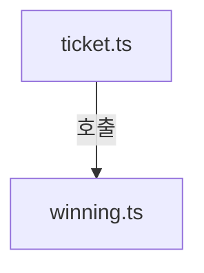
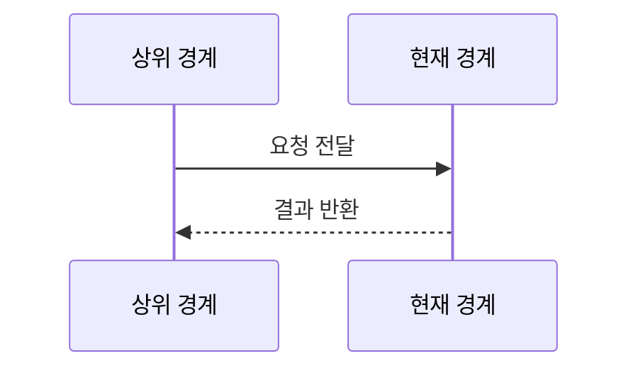
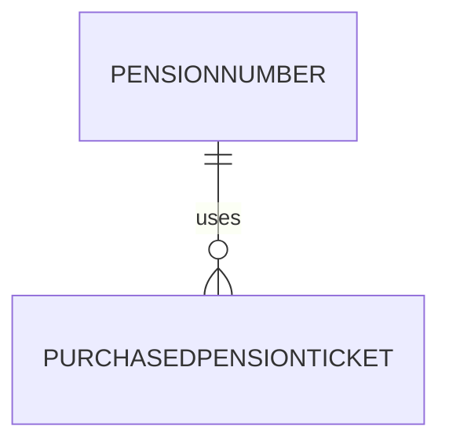

# pension720/domain 구현 상세
Schema-Version: SRTE-DOCS-1

## 모듈 분해
- `ticket.ts`: 조/번호/모드 타입과 검증/포맷/라벨 함수.
- `winning.ts`: 당첨번호 타입, 등수 타입, 판정 함수(`checkPensionWinning`).

## 호출 흐름
1. 상위 서비스가 티켓 번호와 당첨번호를 전달한다.
2. `checkPensionWinning`이 등수 판정 규칙을 순차 적용한다.
3. 서비스 계층이 `getRankLabel` 등으로 결과를 표현한다.

## 핵심 알고리즘
- 등수 판정 순서:
  - 1등(조+번호6자리 일치)
  - 2등(조 다름 + 번호6자리 일치)
  - 보너스(보너스번호6자리 일치)
  - 3~7등(앞/뒤 자리수 일치 규칙)
  - 낙첨

## 데이터 모델
- `PensionNumber`: `group(1~5)` + `number(6자리 문자열)`.
- `PurchasedPensionTicket`: 회차/슬롯/번호/모드/옵션 날짜.
- `PensionWinningNumbers`: 회차/추첨일/1등 조+번호/보너스번호.

## 외부 연동 정책
- 외부 서비스/라이브러리 연동 없음.
- timeout/retry/backoff/circuit breaker/idempotency key: 해당 없음.

## 설정
- 환경 변수 직접 사용 없음.
- 함수 인자 기반 계산만 수행.

## 예외 처리 전략
- 함수 내 명시적 throw 없음.
- 형식 검증은 boolean 반환 함수(`isValidGroup`, `isValidPensionNumber`)로 제공.

## 관측성
- 별도 로깅/메트릭 구현 없음.

## 테스트 설계
- 단위 테스트: `winning.test.ts`, `ticket.test.ts`에서 등수 판정과 형식 검증 규칙을 검증.

## 시나리오 추적성 (권장)
| SCN | 구현 파일#심볼 | 테스트명 |
|---|---|---|
| SCN-001 | `src/pension720/domain/winning.ts#checkPensionWinning` | `src/pension720/domain/winning.test.ts::returns rank1 when group and six digits are exact match` |
| SCN-002 | `src/pension720/domain/ticket.ts#isValidGroup` | `src/pension720/domain/ticket.test.ts::returns false for invalid group numbers` |

## 파일 계약 (핵심 파일 상세, 권장)
| 파일 | 외부 노출 심볼 | 입력 | 출력 | 오류/제약 |
|---|---|---|---|---|
| `ticket.ts` | `isValidGroup`, `isValidPensionNumber`, `formatPensionNumber` | 조/번호 값 | boolean/포맷 문자열 | 조는 1~5, 번호는 6자리 규칙 |
| `winning.ts` | `checkPensionWinning`, `getRankLabel` | 구매번호, 당첨번호 | `PensionWinningRank`, 라벨 문자열 | 상위 등수 우선 판정 |

## 변경 규칙 (권장)
- MUST: 등수 판정 순서(1등→2등→보너스→3~7등→낙첨)를 유지한다.
- MUST: 번호 형식은 6자리 문자열 규칙을 유지한다.
- MUST NOT: 도메인 함수에서 명시적 예외 throw를 추가하지 않는다.
- 함께 수정할 테스트 목록: `src/pension720/domain/winning.test.ts`, `src/pension720/domain/ticket.test.ts`.

## 알려진 제약
- 번호 비교는 문자열 접두/접미 비교 규칙에 고정되어 있다.

## 오픈 질문
- 없음
