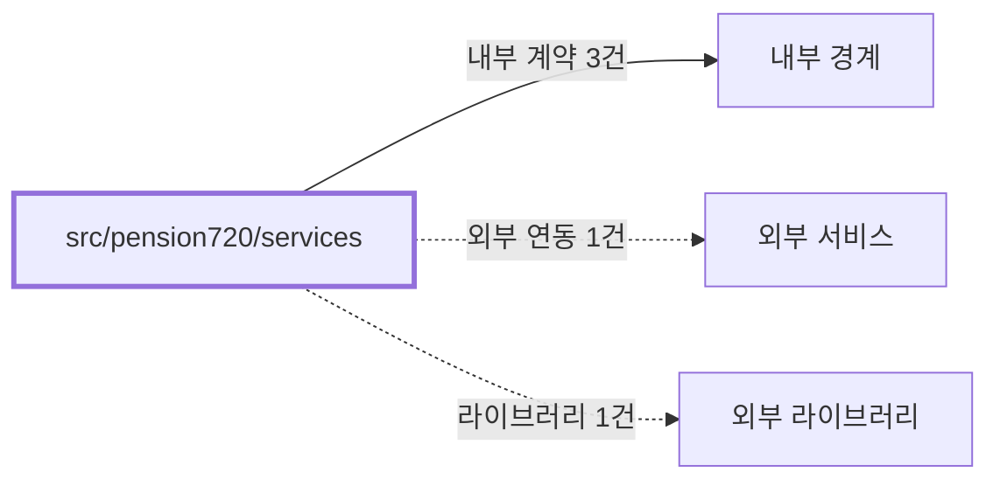

# pension720/services
Schema-Version: SRTE-DOCS-1

## 목적
이 경계는 연금복권 720+ 결과를 콘솔/이메일 포맷으로 변환하는 계약을 제공한다.
당첨 집계와 템플릿 생성 규칙을 일관되게 유지한다.

## 기능 범위/비범위
- 포함: `checkTicketsWinning`, `printWinningResult` 제공.
- 포함: 구매 성공/실패/당첨 결과 이메일 템플릿 생성.
- 비포함: SMTP 전송 실행, 브라우저 자동화 실행.

## 공개 인터페이스 계약
- 입력 타입/필드:
  - `PurchasedPensionTicket[]`, `PensionWinningNumbers`, 오류 문자열.
- 필수/옵션:
  - 집계 함수 입력은 필수.
  - 템플릿의 텍스트 본문은 구현상 항상 생성되나 소비는 선택 가능.
- 유효성 규칙:
  - 집계 결과 `winnerCount <= totalCount`를 만족한다.
  - 오류 템플릿은 오류 문자열을 HTML 이스케이프한다.
- 출력 타입/필드:
  - `PensionWinningCheckResult`.
  - `{ subject, html, text }`.

## 행동 시나리오
- SCN-001: Given 티켓 목록과 당첨번호, When 집계 함수를 호출, Then `winnerCount<=totalCount` and `round=winningNumbers.round`.
- SCN-002: Given 구매 실패 또는 낙첨 결과, When 템플릿 함수를 호출, Then `subject contains "실패" or "낙첨"` and `html contains resultSummary`.

## 오류 계약
- 에러 코드: 없음(명시적 에러 코드 상수 없음).
- HTTP status(해당 시): 없음.
- 재시도 가능 여부: 해당 없음.
- 발생 조건: 명시적 throw 경로 없이 실패 템플릿/집계 결과를 반환한다.

## 불변식/제약
- 트랜잭션 경계: 없음.
- 정합성 규칙: 집계 결과 `round`는 입력 당첨정보의 회차와 동일하다.
- 멱등성 규칙: 동일 입력이면 동일 결과를 생성한다.
- 순서 보장 규칙: 결과 목록은 입력 티켓 순서를 유지한다.

## 비기능 요구
- 성능(SLO): 동기 집계/문자열 생성 경계로 별도 수치형 SLO를 정의하지 않는다.
- 보안 요구: 템플릿에 포함되는 오류 텍스트는 HTML 이스케이프 처리한다.
- 타임아웃: 해당 없음.
- 동시성 요구: 공유 상태 없음.

## 의존성 계약
- 내부 경계: `src/pension720/domain`, `src/shared/utils/date`, `src/shared/utils/html`.
- 외부 서비스: 없음.
- 외부 라이브러리: 없음.

## 수용 기준
- [ ] 집계 함수가 티켓별 등수와 전체 요약을 반환한다.
- [ ] 콘솔 출력 함수가 집계 결과를 읽기 쉬운 형태로 출력한다.
- [ ] 이메일 템플릿이 구매/실패/당첨 케이스를 모두 지원한다.
