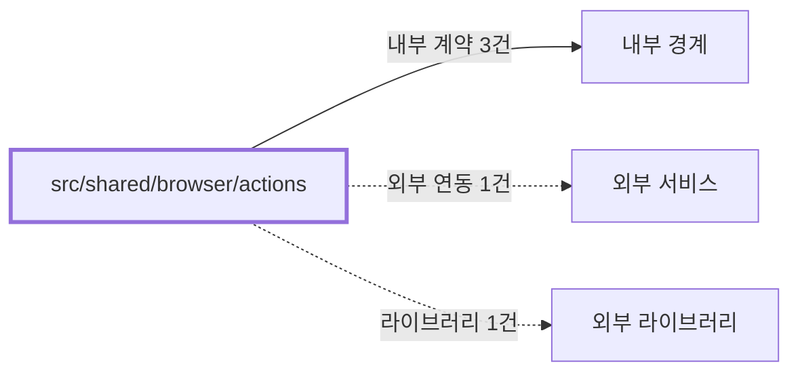

# shared/browser/actions
Schema-Version: SRTE-DOCS-1

## 목적
이 경계는 게임 공통 브라우저 액션 계약을 제공한다.
로그인과 구매내역 이동을 재사용 가능한 단위로 표준화한다.

## 기능 범위/비범위
- 포함: `login`, `navigateToPurchaseHistory`, `getBarcodeElements`, `LOTTERY_PRODUCTS` 제공.
- 포함: 네트워크/타임아웃 재시도 및 오류 스크린샷 연계.
- 비포함: 브라우저 세션 생성, 도메인별 티켓 파싱, 이메일 전송.

## 공개 인터페이스 계약
- 입력 타입/필드:
  - `Page`.
  - 상품 코드(`LO40`/`LP72`).
  - 스크린샷 파일명 접두어.
- 필수/옵션:
  - `Page`/상품 코드는 필수.
  - 스크린샷 접두어는 옵션.
- 유효성 규칙:
  - 로그인은 `LOTTO_USERNAME`, `LOTTO_PASSWORD`가 없으면 실패한다.
  - 로그인은 `https://www.dhlottery.co.kr/` 선접속 후 `https://www.dhlottery.co.kr/login` 이동 순서를 따른다.
  - 구매내역 이동은 최근 1주일 + 상품코드 필터를 적용한다.
- 출력 타입/필드:
  - `Promise<void>` 액션 함수.
  - 바코드 `Locator`.
  - `LOTTERY_PRODUCTS` 메타데이터 상수.

## 행동 시나리오
- SCN-001: Given 유효 자격 증명, When `login` 호출, Then `visitedUrls[0]="https://www.dhlottery.co.kr/"` and `visitedUrls[1] contains "/login"` and `loginSuccess=true` and (`logoutButtonVisible=true` or `url contains "main"`).
- SCN-002: Given 홈페이지 또는 로그인 페이지 접근 지연/오류, When `login` 호출, Then `retryAttempted=true` and `error.code=NETWORK_NAVIGATION_TIMEOUT` and `exceptionRaised=true` on final failure.
- SCN-003: Given 구매내역 페이지 접근 지연/오류, When `navigateToPurchaseHistory` 호출, Then `retryAttempted=true` and `error.code=NETWORK_NAVIGATION_TIMEOUT` and `exceptionRaised=true` on final failure.

## 오류 계약
- 에러 코드: `AUTH_INVALID_CREDENTIALS`, `NETWORK_NAVIGATION_TIMEOUT`, `DOM_SELECTOR_NOT_VISIBLE`, `UNKNOWN_UNCLASSIFIED`.
- HTTP status(해당 시): 없음(브라우저 자동화 컨텍스트).
- 재시도 가능 여부: 가능(`withRetry` 적용).
- 발생 조건: 계정 누락, 홈페이지/로그인 페이지 타임아웃, 구매내역 페이지 필터링 실패.

## 불변식/제약
- 트랜잭션 경계: 없음.
- 정합성 규칙: 상품 코드별 모달 ID/티켓 셀렉터 매핑은 `LOTTERY_PRODUCTS` 상수로 고정한다.
- 멱등성 규칙: 동일 페이지 상태에서 반복 호출 시 동일 절차를 수행한다.
- 순서 보장 규칙: 로그인은 `홈페이지 선접속 -> 로그인 페이지 이동 -> 자격증명 제출` 순서를 따른다.
  - 구매내역 이동은 페이지 진입 -> 상세검색 -> 최근1주일 -> 상품선택 -> 검색 순서를 따른다.

## 비기능 요구
- 성능(SLO): 코드에 별도 수치형 SLO 상수는 없다.
- 보안 요구: 비밀번호/계정을 로그에 직접 노출하지 않는다.
- 타임아웃: 주요 이동 60초, 요소 대기 10~30초 범위.
- 동시성 요구: 단일 `Page` 기준 순차 실행 경로를 따른다.

## 의존성 계약
- 내부 경계: `src/shared/browser`, `src/shared/config`, `src/shared/utils`.
- 외부 서비스: 동행복권 로그인/마이페이지.
- 외부 라이브러리: Playwright.

## 수용 기준
- [ ] 공통 로그인 함수가 계정 누락/성공/실패를 구분한다.
- [ ] 공통 로그인 함수가 선접속 순서(`https://www.dhlottery.co.kr/` -> `/login`)를 유지한다.
- [ ] 구매내역 이동 함수가 상품 코드 필터 적용까지 완료한다.
- [ ] 실패 시 재시도 및 스크린샷 저장 동작이 유지된다.
- [ ] 로그인/이동 실패가 구조화된 `error.code`로 분류된다.

## 오픈 질문
- 내용: 홈페이지 선접속 직후 대기 전략을 `domcontentloaded`와 `networkidle` 중 어느 것으로 고정할지 확정 필요.
  - 확인 불가 사유: 저장소 내에는 시간대별 리다이렉트/리소스 로딩 편차 데이터가 없다.
  - 확인 경로: CI/로컬 실행 로그에서 `homepage -> /login` 구간의 URL 전이와 대기 시간을 샘플링한다.
  - 해소 조건: 샘플 50건 기준 실패율이 낮은 대기 전략을 선택해 정책이 확정되면 종료.
