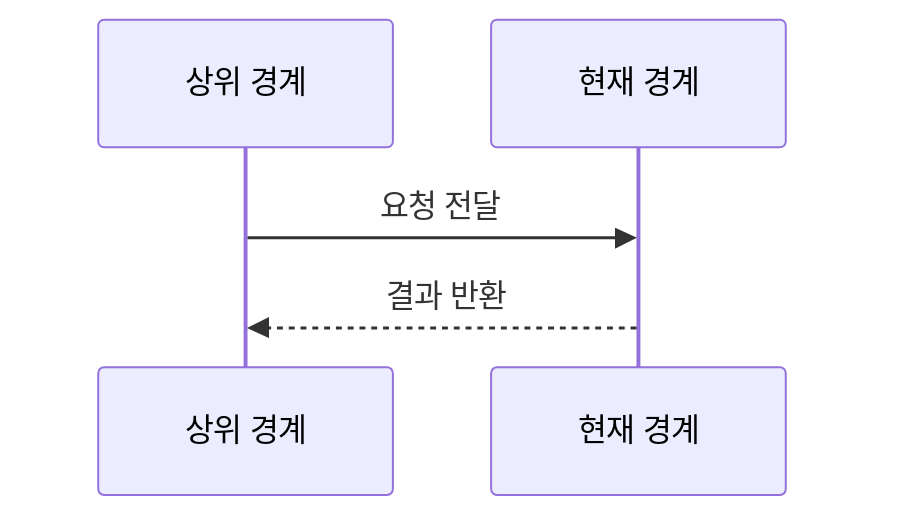
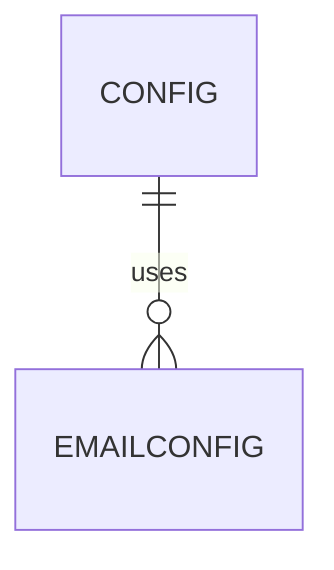

# shared/config 구현 상세
Schema-Version: SRTE-DOCS-1

## 모듈 분해
- `index.ts`: 스키마 정의, 환경 변수 파싱, 설정 캐시 접근(`getConfig`).

## 호출 흐름
1. 상위 경계가 `getConfig()`를 호출한다.
2. 캐시가 없으면 `loadConfig()`가 `process.env`를 읽어 `safeParse`를 실행한다.
3. 파싱 성공 시 결과를 캐시에 저장하고 반환한다.
4. 실패 시 오류 상세 로그를 출력하고 Zod 오류를 throw한다.

## 핵심 알고리즘
- 이메일 설정 판단:
  - `LOTTO_EMAIL_SMTP_HOST`와 `LOTTO_EMAIL_SMTP_PORT` 존재 시에만 email 객체를 구성.
- boolean 전처리:
  - `HEADED`, `CI`는 `'true'` 또는 boolean `true`를 true로 변환.

## 데이터 모델
- `Config`(`username?`, `password?`, `email?`, `headed`, `ci`).
- `EmailConfig`(`smtpHost`, `smtpPort`, `username`, `password`, `from`, `to[]`).

## 외부 연동 정책
- 외부 서비스 연동 없음.
- 스키마 검증 라이브러리로 Zod 사용.
- timeout/retry/backoff/circuit breaker/idempotency key: 해당 없음.

## 설정
- 계정: `LOTTO_USERNAME`, `LOTTO_PASSWORD`.
- 이메일: `LOTTO_EMAIL_SMTP_HOST`, `LOTTO_EMAIL_SMTP_PORT`, `LOTTO_EMAIL_USERNAME`, `LOTTO_EMAIL_PASSWORD`, `LOTTO_EMAIL_FROM`, `LOTTO_EMAIL_TO`.
- 실행 옵션: `HEADED`, `CI`.

## 예외 처리 전략
- 파싱 실패 시 오류 경로/메시지를 순회 출력 후 예외 throw.
- 파싱 성공 후에는 예외 처리 없이 캐시를 반환.

## 관측성
- 설정 오류 시 `console.error`로 필드별 상세를 출력한다.
- 성공 로그/메트릭 전용 구현은 없다.

## 테스트 설계
- 단위 테스트: `src/shared/config/index.test.ts`.
- 필수 케이스: 유효 파싱, 옵션 필드 처리, 불리언 전처리, 이메일 설정 조건부 파싱.

## 시나리오 추적성 (권장)
| SCN | 구현 파일#심볼 | 테스트명 |
|---|---|---|
| SCN-001 | `src/shared/config/index.ts#getConfig` | `src/shared/config/index.test.ts::parses base config and boolean flags` |
| SCN-002 | `src/shared/config/index.ts#loadConfig` | `src/shared/config/index.test.ts::throws when smtp host/port exist but required email fields are missing` |

## 파일 계약 (핵심 파일 상세, 권장)
| 파일 | 외부 노출 심볼 | 입력 | 출력 | 오류/제약 |
|---|---|---|---|---|
| `index.ts` | `getConfig`, `loadConfig`, `hasEmailConfig` | `process.env` | `Config` | Zod 검증 실패 시 예외 throw |
| `index.ts` | `resetConfigForTest` | 없음 | 캐시 초기화 | 테스트 전용 초기화 경로 |

## 변경 규칙 (권장)
- MUST: `getConfig()` 캐시 재사용 규칙을 유지한다.
- MUST: 이메일 설정은 SMTP host/port 존재 시에만 활성화한다.
- MUST NOT: 비밀값을 코드 상수로 하드코딩하지 않는다.
- 함께 수정할 테스트 목록: `src/shared/config/index.test.ts`.

## 알려진 제약
- 런타임 환경 변수 주입이 누락되면 실행 초기에 실패한다.

## 오픈 질문
- 없음
