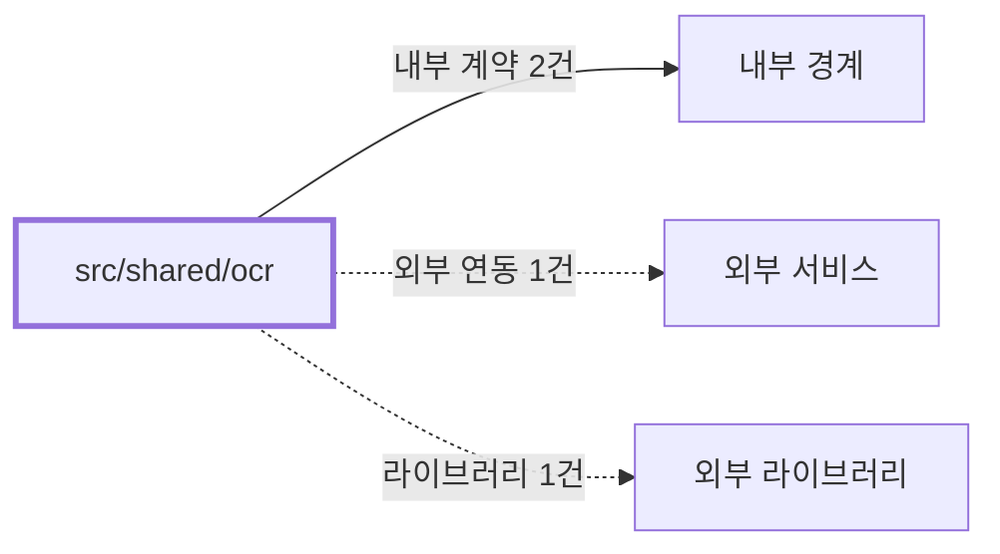

# shared/ocr
Schema-Version: SRTE-DOCS-1

## 목적
이 경계는 Playwright 실패 스크린샷에서 OCR 텍스트를 추출하고, HTML 스냅샷(메인/프레임)과 함께 구조화된 실패 진단 계약을 제공한다.
명령 경계가 실패 원인을 기계적으로 요약/첨부할 수 있도록 공통 포맷을 보장한다.

## 기능 범위/비범위
- 포함: 실패 스크린샷 OCR 추출, OCR 상태/신뢰도/언어/힌트 코드 정규화.
- 포함: 실패 시점 메인 HTML/프레임 HTML 스냅샷 수집 결과 정규화.
- 포함: OCR/HTML 실패를 주 실패 원인과 분리해 상태 객체로 반환.
- 비포함: 브라우저 세션 생성/종료, SMTP 전송, 도메인 비즈니스 판정.

## 공개 인터페이스 계약
- 입력 타입/필드:
  - 스크린샷 파일 경로(`screenshots/*.png`), `Page`, 파일명 prefix, OCR 옵션(`timeoutMs`, `lang`, `fallbackText?`, `extractor?`).
  - OCR 힌트 매핑 입력(`ocr.text`, selector/maintenance 진단 문자열).
- 필수/옵션:
  - 스크린샷 경로와 `Page`는 필수.
  - OCR 언어/타임아웃은 옵션이며 기본값을 제공한다.
- 유효성 규칙:
  - OCR 처리 타임아웃은 `ocrTimeoutMs<=5000`.
  - HTML 스냅샷은 `artifacts/html-failures/` 경로에 저장한다.
  - HTML/텍스트 출력은 민감 필드(`password`, `token`, `authorization`)를 마스킹한다.
- 출력 타입/필드:
  - `ocr.status`, `ocr.text`, `ocr.confidence`, `ocr.lang`, `ocr.hintCode`, `ocr.failureReason?`.
  - `html.status`, `html.main.path?`, `html.frames[]`, `html.failureReason?`, `html.captureTs`, `html.url`.

## 행동 시나리오
- SCN-001: Given 실패 스크린샷 경로와 fallback 진단 문자열, When OCR 추출 실행, Then `ocr.status=SUCCESS` and `ocr.text!=""` and `ocr.hintCode!=null`.
- SCN-002: Given 실패 시점 페이지 컨텍스트와 iframe 존재, When HTML 스냅샷 실행, Then `html.status=SUCCESS` and `html.main.path!=null` and `html.frames.length>=0`.
- SCN-003: Given OCR 또는 HTML 캡처 중 오류, When 후처리 결과 반환, Then `ocr.status=FAILED` or `html.status=FAILED` and `failureReason!=null` and `primaryError.code!=null`.

## 오류 계약
- 에러 코드: `OCR_ENGINE_UNAVAILABLE`, `OCR_TIMEOUT`, `OCR_TEXT_NOT_FOUND`, `OCR_EXTRACTION_FAILED`, `UNKNOWN_UNCLASSIFIED`.
- HTTP status(해당 시): 없음(CLI 실패 후처리 컨텍스트).
- 재시도 가능 여부: `OCR_TIMEOUT`은 true, 그 외 false.
- 발생 조건: OCR 엔진 미연동/초기화 실패, OCR 처리 시간 초과, 유효 텍스트 미검출, HTML 캡처 시 페이지 컨텍스트 손실.

## 불변식/제약
- 트랜잭션 경계: 없음.
- 정합성 규칙: `primaryError.code`는 OCR/HTML 실패로 덮어쓰지 않는다.
- 멱등성 규칙: 동일 입력 아티팩트에 대해 동일한 정규화 포맷을 반환한다(타임스탬프 필드 제외).
- 순서 보장 규칙: 스크린샷 저장 후 OCR, HTML 스냅샷 순으로 후처리를 수행한다.

## 비기능 요구
- 성능(SLO): 단일 스크린샷 OCR 처리 `ocrLatencyMs<=2000`.
- 보안 요구: OCR/HTML 결과에 비밀값 평문 노출 금지(`secretLeakCount=0`).
- 타임아웃: OCR 처리 `<=5000ms`, HTML 캡처는 실패 후처리 상한 내 완료.
- 동시성 요구: 병렬 실패 처리에서도 이벤트별 출력 경로 충돌이 없어야 한다.

## 의존성 계약
- 내부 경계: `src/shared/browser`, `src/shared/utils`.
- 외부 서비스: 없음(기본 경로는 로컬 OCR 엔진).
- 외부 라이브러리: Playwright(HTML 캡처). OCR 엔진은 기본 미연동이며 `extractor` 주입 또는 fallback 텍스트 경로를 사용한다.

## 수용 기준
- [ ] OCR 결과 구조(`ocr.status`, `ocr.text`, `ocr.hintCode`)가 항상 생성된다.
- [ ] HTML 스냅샷(메인/프레임) 경로 또는 실패 사유가 항상 생성된다.
- [ ] OCR/HTML 실패가 주 실패 코드(`primaryError.code`)를 덮어쓰지 않는다.
- [ ] 비밀 마스킹 규칙과 타임아웃/페이로드 제한 계약이 유지된다.

## 오픈 질문
- 내용: 기본 OCR 언어를 `kor+eng`로 고정할지 운영 환경별 가변으로 둘지 확정 필요.
  - 확인 불가 사유: 실패 스크린샷 언어 분포 통계가 저장소에 없다.
  - 확인 경로: 최근 운영 실패 아티팩트 샘플 100건 언어 분포 분석.
  - 해소 조건: 언어별 정확도/지연 비교 결과가 정책 문서로 확정되면 종료.
