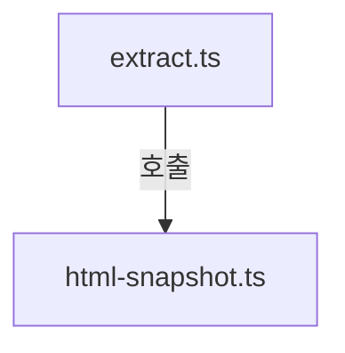
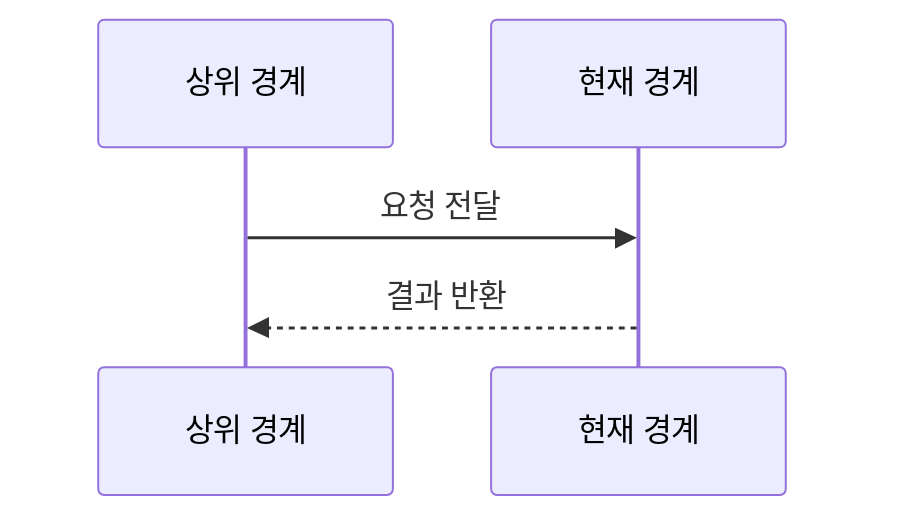
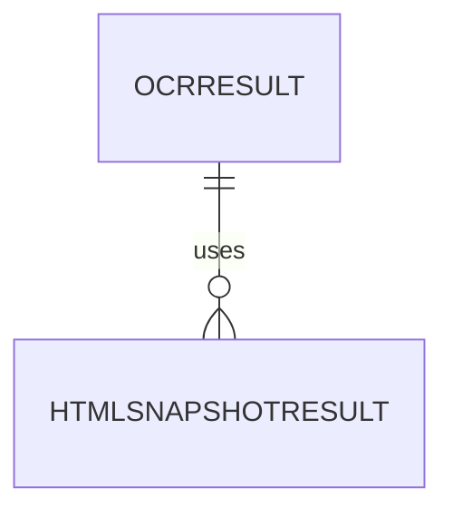

# shared/ocr 구현 상세
Schema-Version: SRTE-DOCS-1

## 모듈 분해
- `extract.ts`: 스크린샷 OCR 추출 실행, 타임아웃/실패 상태 정규화.
- `html-snapshot.ts`: 메인/프레임 HTML 캡처 및 파일 저장.
- `normalize.ts`: OCR 텍스트 힌트 코드 매핑 및 결과 포맷 통합.

## 호출 흐름
1. 상위 명령 경계가 실패 시 저장된 스크린샷 경로와 `Page`를 전달한다.
2. OCR 추출 함수가 텍스트/신뢰도/언어를 수집하고 상태를 정규화한다.
3. HTML 스냅샷 함수가 메인 HTML과 프레임 HTML을 저장한다.
4. 정규화 함수가 `ocr.hintCode`, `html.status`, 실패 사유를 병합해 반환한다.
5. 상위 경계가 메일 첨부/콘솔 출력 정책(10MB 상한 포함)을 적용한다.

## 핵심 알고리즘
- OCR 추출:
  - 입력 이미지 경로 유효성 검증.
  - `extractor`가 주입되면 OCR 실행 결과 텍스트를 기준으로 힌트 코드를 매핑한다.
  - `extractor` 미주입 시 `fallbackText`가 있으면 성공 결과를 생성하고 힌트 코드를 매핑한다.
  - OCR 엔진 미연동(= `extractor`/`fallbackText` 모두 없음)에서는 `OCR_ENGINE_UNAVAILABLE` 실패를 반환한다(`timeoutMs<=5000`).
- HTML 스냅샷:
  - `page.content()`로 메인 HTML 저장.
  - `page.frames()`를 순회해 프레임 HTML 저장.
  - 캡처 실패 시 `html.status=FAILED`와 `failureReason` 기록.
- 힌트 매핑:
  - 키워드 우선순위(`DOM` -> `NETWORK` -> fallback)로 `ocr.hintCode` 결정.

## 데이터 모델
- `OcrResult`: `status`, `text`, `confidence`, `lang`, `hintCode`, `failureReason?`.
- `HtmlSnapshotResult`: `status`, `main`, `frames`, `failureReason?`, `captureTs`, `url`.
- `FailureArtifacts`: `screenshotPath`, `ocr`, `html`, `attachmentCandidates`.

## 외부 연동 정책
- Playwright `Page` API로 HTML 캡처를 수행한다.
- OCR 엔진은 현재 기본 미연동이며 필요 시 `extractor` 주입 또는 `fallbackText` 경로로 추론 결과를 생성한다.
- timeout/retry/backoff:
  - OCR 처리 timeout `<=5000ms`.
  - OCR timeout 오류(`OCR_TIMEOUT`)는 재시도 가능으로 분류한다.
- circuit breaker/idempotency key: 구현하지 않는다.

## 설정
- OCR 언어 기본값: `kor+eng`(정책 확정 전 가정값).
- OCR 타임아웃 기본값: `5000ms`.
- HTML 저장 경로: `artifacts/html-failures/`.

## 예외 처리 전략
- OCR 실행 오류는 `OCR_ENGINE_UNAVAILABLE`/`OCR_EXTRACTION_FAILED`로 변환한다.
- OCR 결과가 비어 있으면 `OCR_TEXT_NOT_FOUND`로 분류한다.
- HTML 캡처 오류는 throw 대신 상태 객체(`html.status=FAILED`)로 반환한다.
- 주 실패 코드(`primaryError.code`)는 상위 경계에서 유지되며 이 경계는 덮어쓰지 않는다.

## 관측성
- OCR 시작/종료/실패를 로그 필드(`ocr.status`, `ocr.hintCode`, `ocrLatencyMs`)로 기록한다.
- HTML 저장 경로(메인/프레임 수)를 로그로 기록한다.
- 민감 문자열 마스킹 여부(`secretLeakCount`)를 검증 로그로 기록한다.

## 테스트 설계
- 단위 테스트: OCR 텍스트 매핑, timeout/failure 분기, HTML 프레임 캡처 정규화.
- 통합 테스트: 명령 실패 경로에서 artifacts 병합 및 메일 첨부 후보 생성.
- 시나리오-테스트 매핑 규칙:
  - SCN-001 -> OCR 성공/힌트 매핑 테스트.
  - SCN-002 -> HTML 메인/프레임 캡처 테스트.
  - SCN-003 -> OCR/HTML 실패 분리 기록 테스트.

## 파일 계약 (핵심 파일 상세, 권장)
| 파일 | 외부 노출 심볼 | 입력 | 출력 | 오류/제약 |
|---|---|---|---|---|
| `extract.ts` | `extractFailureOcr` | screenshot path, options | `OcrResult` | OCR timeout 5초, 엔진 실패 코드 변환 |
| `html-snapshot.ts` | `captureFailureHtml` | `Page`, prefix | `HtmlSnapshotResult` | 페이지 종료 시 `FAILED` 상태 반환 |
| `normalize.ts` | `buildFailureArtifacts` | `primaryError`, `OcrResult`, `HtmlSnapshotResult` | `FailureArtifacts` | `primaryError.code` overwrite 금지 |

## 시나리오 추적성 (권장)
| SCN | 구현 파일#심볼 | 테스트명 |
|---|---|---|
| SCN-001 | `src/shared/ocr/extract.ts#extractFailureOcr` | `src/shared/ocr/extract.test.ts::extracts text and maps hint code for readable screenshot` |
| SCN-002 | `src/shared/ocr/html-snapshot.ts#captureFailureHtml` | `src/shared/ocr/html-snapshot.test.ts::captures main and frame html paths` |
| SCN-003 | `src/shared/ocr/normalize.ts#buildFailureArtifacts` | `src/shared/ocr/normalize.test.ts::keeps primary error and records ocr_or_html_failure_reason` |

## 변경 규칙 (권장)
- MUST: OCR 실패는 주 실패 코드 덮어쓰기를 금지한다.
- MUST: HTML 캡처 실패를 throw로 승격하지 않고 상태 객체로 반환한다.
- MUST: 민감 필드 마스킹 규칙(`password`, `token`, `authorization`)을 유지한다.
- MUST NOT: 첨부 총량 상한(10MB) 정책을 우회하는 후보 목록을 생성하지 않는다.
- 함께 수정할 테스트 목록: `src/shared/ocr/extract.test.ts`, `src/shared/ocr/html-snapshot.test.ts`, `src/shared/ocr/normalize.test.ts`, `tests/lotto645.spec.ts`, `tests/pension720.spec.ts`.

## 알려진 제약
- OCR 정확도는 이미지 품질/폰트/언어 혼합도에 따라 변동될 수 있다.
- 페이지 컨텍스트가 이미 종료된 경우 프레임 HTML 일부는 수집되지 않을 수 있다.

## 오픈 질문
- 내용: 클라우드 OCR fallback 허용 여부(비용/보안 정책) 확정 필요.
  - 확인 불가 사유: 현재 저장소 문서에서 외부 전송 허용 정책이 명시되어 있지 않다.
  - 확인 경로: 운영 보안 정책 문서와 관리자 승인 기록 확인.
  - 해소 조건: 허용/불가 정책과 비용 상한이 문서로 확정되면 종료.
