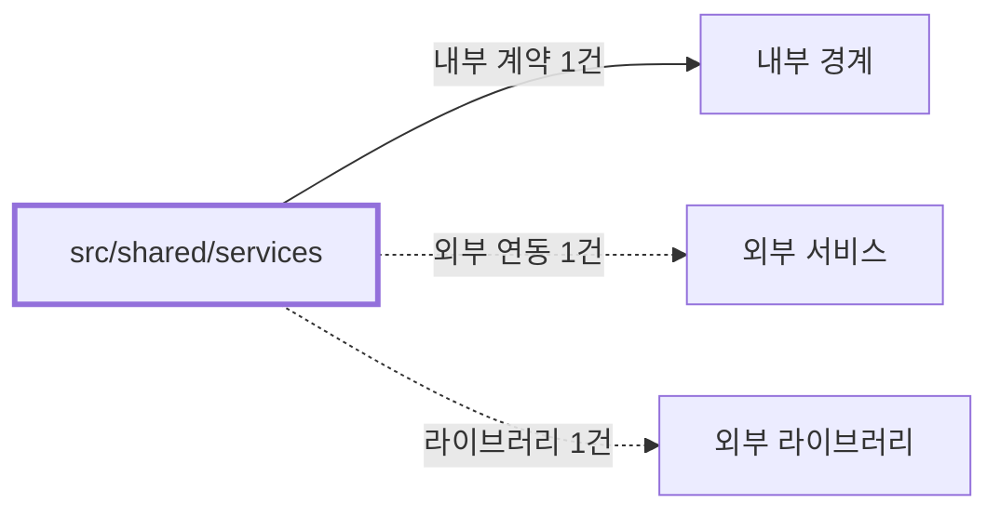

# shared/services
Schema-Version: SRTE-DOCS-1

## 목적
이 경계는 공통 이메일 전송 서비스 계약을 제공한다.
SMTP 설정 기반 메일 발송 결과를 표준 결과 타입으로 반환한다.

## 기능 범위/비범위
- 포함: SMTP 트랜스포터 생성 및 이메일 전송.
- 포함: 이메일 설정 존재 여부 검사(`hasEmailConfig`).
- 포함: 실패 진단 첨부(`screenshots/*.png`, `artifacts/html-failures/*.html`) 전송.
- 비포함: 템플릿 내용 생성, 큐/재시도 기반 메일 파이프라인.

## 공개 인터페이스 계약
- 입력 타입/필드:
  - `EmailOptions`(`subject`, `html`, `text?`, `attachments?`).
  - 설정(`Config.email`).
- 필수/옵션:
  - `subject`, `html`은 필수.
  - `text`는 옵션.
  - `attachments`는 옵션.
- 유효성 규칙:
  - 이메일 설정이 없으면 전송하지 않고 실패 결과를 반환한다.
  - `secure` 설정은 SMTP 포트 465 여부로 결정한다.
  - 첨부 총량은 10MB 상한을 적용하고, 초과 시 부분 첨부 상태를 반환한다.
- 출력 타입/필드:
  - `EmailResult`(`success`, `messageId?`, `error?`, `errorCode?`, `errorCategory?`, `attachmentStatus?`).
  - `boolean` (`hasEmailConfig`).

## 행동 시나리오
- SCN-001: Given 유효 SMTP 설정, When `sendEmail` 호출, Then `success=true` and `messageId!=undefined`.
- SCN-002: Given SMTP 설정 누락 또는 전송 오류, When `sendEmail` 호출, Then `success=false` and `errorCode=EMAIL_SEND_FAILED` and 오류 메시지를 반환한다.
- SCN-003: Given 실패 첨부 파일이 제공됨, When `sendEmail` 호출, Then `attachmentStatus=FULL` or `attachmentStatus=PARTIAL` and `success=true`.

## 오류 계약
- 에러 코드: `EMAIL_SEND_FAILED`, `UNKNOWN_UNCLASSIFIED`.
- HTTP status(해당 시): 없음.
- 재시도 가능 여부: 없음(이 경계 내 재시도 로직 미구현).
- 발생 조건: 이메일 설정 누락, SMTP 인증/연결 실패, 전송 예외, 첨부 상한 초과.

## 불변식/제약
- 트랜잭션 경계: 없음.
- 정합성 규칙: 반환 결과는 성공/실패를 `EmailResult.success`로 일관되게 표현한다.
- 멱등성 규칙: 동일 입력 재호출 시 외부 SMTP 상태에 따라 결과가 달라질 수 있다.
- 순서 보장 규칙: 설정 확인 후에만 트랜스포터 생성/전송을 시도한다.

## 비기능 요구
- 성능(SLO): 코드에 별도 수치형 SLO 상수는 없다.
- 보안 요구: SMTP 비밀번호는 환경 변수에서만 주입한다.
- 타임아웃: 명시적 nodemailer timeout 설정은 없다.
- 동시성 요구: 함수 호출 단위로 독립 실행되며 공유 mutable 상태가 없다.

## 의존성 계약
- 내부 경계: `src/shared/config`.
- 외부 서비스: SMTP 서버.
- 외부 라이브러리: Nodemailer.

## 수용 기준
- [ ] 이메일 설정 유무에 따라 전송 시도 여부가 결정된다.
- [ ] 전송 결과가 `EmailResult` 형식으로 반환된다.
- [ ] 실패 시 예외 대신 실패 결과를 반환하는 경로가 유지된다.
- [ ] 실패 결과(`EmailResult`)에 `errorCode`와 `errorCategory`가 포함된다.
- [ ] 첨부 사용 시 10MB 상한과 부분 첨부(`attachmentStatus=PARTIAL`) 정책이 유지된다.
