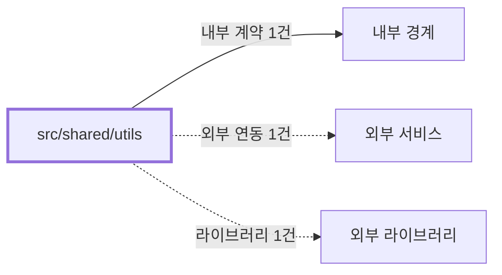

# shared/utils
Schema-Version: SRTE-DOCS-1

## 목적
이 경계는 도메인 공통 순수 유틸리티 계약을 제공한다.
재시도, 날짜, HTML 이스케이프 규칙을 공통화한다.

## 기능 범위/비범위
- 포함: `withRetry`, `parseSaleDate`, `isWithinMinutes`, `formatDateKorean`, `isToday`, `formatDateDot`, `escapeHtml`.
- 포함: `buildFailureEmailTemplate` 공통 실패 이메일 HTML 빌더.
- 포함: `handleCommandFailure` 공통 커맨드 실패 처리(스크린샷/HTML/OCR 아티팩트 수집 → 로깅 → 이메일 전송 → exit).
- 포함: OCR 텍스트 힌트 -> 운영 에러 코드 매핑 유틸.
- 포함: 지수 백오프 + 지터 재시도 정책.
- 비포함: 브라우저 제어, 네트워크 요청, 도메인 판정 로직.

## 공개 인터페이스 계약
- 입력 타입/필드:
  - 비동기 함수(`() => Promise<T>`), 날짜 문자열/객체, 일반 문자열, OCR 추출 문자열.
- 필수/옵션:
  - `withRetry` 옵션은 모두 선택(`maxRetries`, `baseDelayMs`, `maxDelayMs`, `shouldRetry`, `log`).
- 유효성 규칙:
  - `parseSaleDate`는 사이트 문자열 패턴 미일치 시 `null` 반환.
  - `isValid` 개념 함수는 없음(입력 검증은 호출자 책임).
  - `escapeHtml`은 `& < > " '`를 엔티티로 치환.
- 출력 타입/필드:
  - 재시도 성공 시 원본 함수 결과, 실패 시 마지막 오류 throw.
  - 문자열 포맷 결과 또는 boolean 판정 값.
  - OCR 힌트 코드(`DOM_SELECTOR_NOT_VISIBLE`, `NETWORK_NAVIGATION_TIMEOUT`, `UNKNOWN_UNCLASSIFIED`).

## 행동 시나리오
- SCN-001: Given 일시적 네트워크 오류 함수, When `withRetry` 호출, Then `attemptCount<=maxRetries+1` and (`resultReturned=true` or (`errorThrown=true` and `retry.lastErrorMessage!=null`)).
- SCN-002: Given 형식 불일치 발행일 문자열, When `parseSaleDate` 호출, Then `returnValue=null`.
- SCN-003: Given OCR 텍스트에 점검/차단 키워드 포함, When 힌트 매핑 함수를 호출, Then `ocr.hintCode!=UNKNOWN_UNCLASSIFIED` and `ocr.hintCode!=null`.

## 오류 계약
- 에러 코드: `NETWORK_NAVIGATION_TIMEOUT`, `DOM_SELECTOR_NOT_VISIBLE`, `UNKNOWN_UNCLASSIFIED`.
- HTTP status(해당 시): 없음.
- 재시도 가능 여부: `withRetry`의 `shouldRetry` 규칙에 따름.
- 발생 조건: `withRetry`에서 모든 시도 실패 시 마지막 오류 throw.

## 불변식/제약
- 트랜잭션 경계: 없음.
- 정합성 규칙: 유틸 함수는 입력 외부 상태를 변경하지 않는다.
- 멱등성 규칙: 동일 입력에서 동일 출력(시간 의존 함수 제외)을 반환한다.
- 순서 보장 규칙: `withRetry`는 시도 순서대로 지연 후 재실행한다.

## 비기능 요구
- 성능(SLO): 유틸 함수 경계로 별도 수치형 SLO 상수는 없다.
- 보안 요구: HTML 이스케이프 함수로 템플릿 삽입 문자열을 보호한다.
- 타임아웃: `withRetry` 자체 timeout 옵션은 명시적으로 제공하지 않는다.
- 동시성 요구: 공유 상태 없음.

## 의존성 계약
- 내부 경계: 없음.
- 외부 서비스: 없음.
- 외부 라이브러리: 없음.

## 수용 기준
- [ ] 재시도 유틸이 지수 백오프/지터 정책을 적용한다.
- [ ] 날짜 유틸이 사이트 문자열 형식 기준 동작을 제공한다.
- [ ] HTML 이스케이프 함수가 특수문자 치환을 수행한다.
- [ ] `withRetry` 최종 실패에 `retry.lastErrorMessage`와 분류 코드가 포함된다.
- [ ] OCR 힌트 매핑이 `UNKNOWN_UNCLASSIFIED` fallback을 포함해 결정형으로 동작한다.
- [ ] `buildFailureEmailTemplate`이 모든 도메인 실패 이메일에서 공통 사용된다.
- [ ] `handleCommandFailure`가 모든 커맨드의 catch 블록에서 공통 사용된다.
