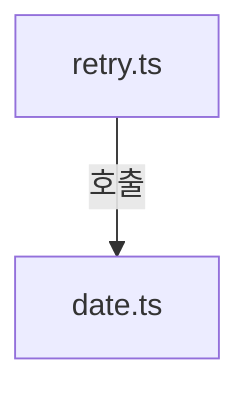
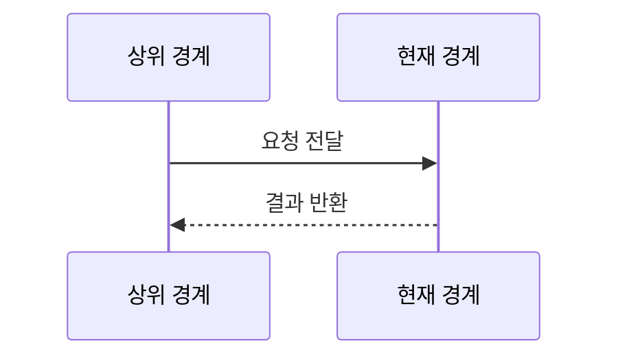
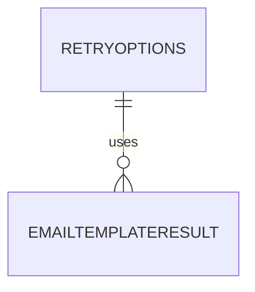

# shared/utils 구현 상세
Schema-Version: SRTE-DOCS-1

## 모듈 분해
- `retry.ts`: 재시도 옵션/지연 계산/재시도 래퍼 함수.
- `date.ts`: 발행일 파싱, 시간 범위 판정, 날짜 포맷 함수.
- `html.ts`: HTML 이스케이프 함수와 템플릿 반환 타입.
- `error.ts`: 오류 taxonomy, OCR 힌트 코드/요약 포맷 정규화.

## 호출 흐름
1. 상위 경계가 네트워크/브라우저 액션을 `withRetry`로 감싼다.
2. 구매내역 파서가 발행일 문자열을 `parseSaleDate`로 변환한다.
3. 실패 후처리가 OCR 텍스트를 받아 힌트 코드 매핑/요약 포맷을 생성한다.
4. 서비스 템플릿이 `escapeHtml` 및 날짜 포맷 함수를 호출한다.

## 핵심 알고리즘
- `withRetry`:
  - 최대 시도 횟수만큼 함수 실행.
  - 실패 시 재시도 가능 여부 판단.
  - 지수 백오프 + 지터 지연 후 재실행.
- `parseSaleDate`:
  - 정규식으로 날짜/시간을 추출해 `+09:00` ISO 문자열 생성.

## 데이터 모델
- `RetryOptions`: `maxRetries`, `baseDelayMs`, `maxDelayMs`, `shouldRetry`, `log`.
- `EmailTemplateResult`: `subject`, `html`, `text`.
- `AppErrorCode`, `AppErrorCategory`, `RetryDiagnostic`, OCR 힌트 매핑 결과.

## 외부 연동 정책
- 외부 서비스 호출 없음.
- retry/backoff는 `withRetry` 내부 정책으로 구현.
- timeout/circuit breaker/idempotency key: 해당 없음.

## 설정
- 환경 변수 직접 사용 없음.
- 함수 파라미터로 동작을 제어한다.

## 예외 처리 전략
- `withRetry`는 최종 실패 시 마지막 오류를 throw한다.
- 날짜/HTML 유틸은 예외 대신 보정값(`null`, 원문 반환)을 제공한다.
- OCR 힌트 매핑은 미일치 시 `UNKNOWN_UNCLASSIFIED`를 반환하고 `classificationReason`을 기록한다.

## 실패 상세 진단 구현 정책
- `withRetry`는 최종 실패 throw 전에 `retry.attemptCount`, `retry.maxRetries`, `retry.lastErrorMessage`를 구성 가능한 구조로 유지한다.
- 네트워크/타임아웃 분류는 `NETWORK_NAVIGATION_TIMEOUT` 우선, 미분류는 `UNKNOWN_UNCLASSIFIED`로 귀결한다.
- 분류는 호출자에서 `error.retryable` 판단에 재사용 가능해야 한다.
- OCR 텍스트 분류는 키워드 우선순위(`DOM` -> `NETWORK` -> fallback)를 유지해 결정형 매핑을 보장한다.

## 관측성
- `withRetry` 재시도 시 경고 로그를 출력할 수 있다(`log=true`).
- 그 외 메트릭/트레이싱 구현은 없다.

## 테스트 설계
- 단위 테스트: `retry.test.ts`, `date.test.ts`.
- 필수 케이스: 재시도 조건 분기, 지연 계산, 날짜 파싱/포맷 경계값, OCR 힌트 매핑 fallback.

## 시나리오 추적성 (권장)
| SCN | 구현 파일#심볼 | 테스트명 |
|---|---|---|
| SCN-001 | `src/shared/utils/retry.ts#withRetry` | `src/shared/utils/retry.test.ts::retries until success when retry condition is met` |
| SCN-002 | `src/shared/utils/date.ts#parseSaleDate` | `src/shared/utils/date.test.ts::returns null for invalid sale date string` |
| SCN-003 | `src/shared/utils/error.ts#classifyErrorMessage` | `src/shared/utils/retry.test.ts::maps OCR hint text into known error code or unknown fallback` |

## 파일 계약
| 구현 파일#심볼 | 입력 | 출력 | 오류 | 제약 |
|---|---|---|---|---|
| `src/shared/utils/retry.ts#withRetry` | `fn: () => Promise<T>`, `options?: RetryOptions` | 성공 시 `T`, 실패 시 마지막 `Error` throw | `NETWORK_NAVIGATION_TIMEOUT` 또는 분류 실패 시 `UNKNOWN_UNCLASSIFIED` | `attemptCount<=maxRetries+1`, 지연은 지수 백오프 + 지터, 기본 `maxRetries=3` |
| `src/shared/utils/date.ts#parseSaleDate` | 동행복권 판매일 문자열 | `Date` 또는 `null` | 예외 throw 대신 `null` 반환 | 입력 형식 불일치 시 반드시 `null` |
| `src/shared/utils/error.ts#classifyErrorMessage` | OCR/에러 원문 문자열 | `AppErrorCode`, `classificationReason` | 미일치 시 예외 대신 fallback 반환 | 우선순위 `DOM` -> `NETWORK` -> `UNKNOWN_UNCLASSIFIED` |

## 변경 규칙
- MUST: `retry.ts#withRetry`의 재시도 횟수 또는 지연 계산을 변경하면 `src/shared/utils/retry.test.ts`를 함께 수정한다.
- MUST: `error.ts#classifyErrorMessage`의 키워드 매핑/우선순위를 변경하면 분류 테스트 케이스를 추가 또는 갱신한다.
- MUST: `parseSaleDate` 입력 패턴을 변경하면 유효/무효 문자열 경계 케이스를 테스트에 반영한다.
- MUST NOT: `UNKNOWN_UNCLASSIFIED` fallback을 제거하거나 빈 문자열 분류를 throw로 변경하지 않는다.
- MUST NOT: `withRetry` 최종 실패에서 원본 오류와 진단 정보(`retry.lastErrorMessage`) 전달을 누락하지 않는다.
- 함께 수정할 테스트: `src/shared/utils/retry.test.ts`, `src/shared/utils/date.test.ts`, `src/shared/services/email.service.test.ts`.

## 알려진 제약
- 날짜 파싱은 동행복권 문자열 형식에 의존한다.

## 오픈 질문
- 없음
